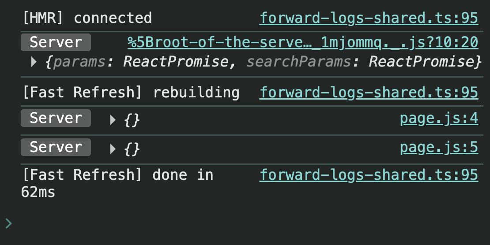
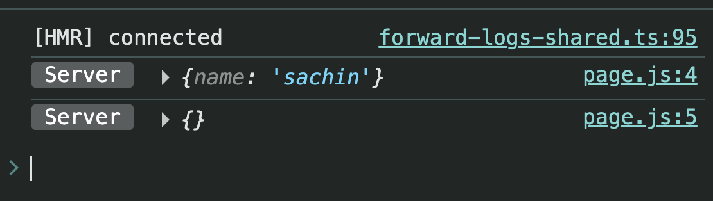

# Next.js Dynamic Routing (App Router)

`app/blogs/[blogId]/page.js`

---

# Introduction

In the **App Router**, every `page.js` receives a **props object**.

```jsx
export default function Blog(props) {
  console.log(props);

  return <h1>Blog Page</h1>;
}
```

When you log `props`, you'll see something like this:

```js
{
    params: Promise,
    searchParams: Promise
}
```

## Screenshot


---

# Understanding the Props Object

The `props` object contains two important properties.

```
props
│
├── params
│      ↓
│   Promise
│
└── searchParams
       ↓
    Promise
```

Both are **Promises** in **Next.js 15+**.

That means you can use

- `await`
- `.then()`
- `.catch()`

---

# Accessing params & searchParams

Since both are promises, make your component `async`.

```jsx
export default async function Blog({ params, searchParams }) {
  console.log(await params);
  console.log(await searchParams);

  return <h1>Blog Page</h1>;
}
```

---

# Visiting

```
/blogs
```

Output

```js
{
}
{
}
```

## Screenshot



### Why?

Because

- No Dynamic Route exists.
- No Query Parameters exist.

So both return an empty object.

---

# Understanding searchParams

Suppose the URL becomes

```
/blogs?name=sachin
```

Now

```jsx
console.log(await searchParams);
```

returns

```js
{
  name: "sachin";
}
```

while

```jsx
console.log(await params);
```

still returns

```js
{
}
```

## Screenshot



---

# What is searchParams?

`searchParams` reads values after the `?`

Example

```
/blogs?name=sachin&page=2&sort=latest
```

becomes

```js
{
    name: "sachin",
    page: "2",
    sort: "latest"
}
```

Think of it like

```
URL

/blogs
   │
   └──── ?name=sachin&page=2

            │
            ▼

searchParams

{
   name: "sachin",
   page: "2"
}
```

---

# But Why Dynamic Routing?

Imagine a website has

- 10 Blogs
- 100 Blogs
- 10,000 Blogs

Will you create

```
app/blogs/blog1
app/blogs/blog2
app/blogs/blog3
app/blogs/blog4
...
```

Absolutely Not.

Instead, Next.js gives us **Dynamic Routing**.

One page can serve **unlimited routes**.

---

# Creating Dynamic Routes

Folder Structure

```
app
│
└── blogs
      │
      └── [blogId]
              │
              └── page.js
```

Notice the folder inside `[]`.

This is called a **Slug**.

---

# Visiting Dynamic URLs

Suppose we visit

```
/blogs/123456789
```

Next.js automatically maps

```
blogId
      ↓
123456789
```

---

# Reading params

```jsx
export default async function Blog({ params }) {
  console.log(await params);

  return <div>Blog</div>;
}
```

Output

```js
{
  blogId: "123456789";
}
```

## Screenshot


---

# Destructuring params

Instead of writing

```jsx
const data = await params;

console.log(data.blogId);
```

simply write

```jsx
export default async function Blog({ params }) {
  const { blogId } = await params;

  return <div>Blog : {blogId}</div>;
}
```

Output

```
Blog : 123456789
```

---

# How Next.js Understands This

```
Folder Name

[blogId]

        │

        ▼

URL

/blogs/123456789

        │

        ▼

params

{
   blogId: "123456789"
}
```

The **folder name becomes the key**, and the **URL segment becomes its value**.

---

# Naming Convention (Best Practice)

Parent folder → **Plural**

```
blogs
products
users
posts
```

Slug folder → **Singular**

```
[blogId]
[productId]
[userId]
[postId]
```

Recommended Structure

```
app
│
├── blogs
│      └── [blogId]
│
├── products
│      └── [productId]
│
└── users
       └── [userId]
```

Although Next.js doesn't enforce this rule, it makes your project much cleaner and easier to understand.

---

# Quick Revision

```
props
│
├── params
│      │
│      └── Dynamic Route
│
└── searchParams
       │
       └── Query Parameters
```

Examples

```
/blogs/101

↓

params

{
   blogId: "101"
}
```

```
/blogs?name=sachin

↓

searchParams

{
   name: "sachin"
}
```

---

# Key Takeaways

- Every `page.js` receives a **props object**.
- `props` contains **params** and **searchParams**.
- In **Next.js 15+**, both are **Promises**.
- Use `await params` and `await searchParams`.
- `searchParams` reads values after `?`.
- `params` reads dynamic route values.
- Dynamic routes are created using square brackets (`[]`).
- The **slug name becomes the key**, and the **URL segment becomes the value**.
- One dynamic page can handle thousands of URLs.
- Prefer **plural** parent folders (`blogs`) and **singular** slug folders (`[blogId]`) for clean project structure.

---

# Final Flow

```text
User Visits URL
        │
        ▼
Next.js Router
        │
        ├───────────────┐
        │               │
        ▼               ▼
Dynamic URL       Query String
/blogs/101        ?name=sachin
        │               │
        ▼               ▼
params        searchParams
        │               │
        ▼               ▼
{ blogId }     { name }
```

---

# Nested Dynamic Routing (Next.js App Router)

---

# What is Nested Dynamic Routing?

Nested Dynamic Routing means creating **dynamic routes inside another dynamic route**.

Instead of handling only one dynamic value, we can handle multiple values from the URL.

Example:

```
/blogs/24/comments/80
```

Here,

- `24` → Blog ID
- `80` → Comment ID

Both values are available inside `params`.

---

# Why do we need it?

Suppose we already have blogs.

```
/blogs/24
```

Now every blog contains hundreds of comments.

We don't just want to show all comments.

Sometimes we want to open a **specific comment**.

Example:

```
/blogs/24/comments/80
```

Without Nested Dynamic Routing, this wouldn't be possible.

---

# Parent Route

Folder Structure

```
app
│
└── blogs
     │
     └── [blogId]
            │
            └── comments
                    │
                    └── page.js
```

Visit

```
/blogs/24/comments
```

Code

```jsx
export default async function Comments({ params }) {
  const paramsObj = await params;

  console.log(paramsObj);

  return <div>Comments Page</div>;
}
```

Output

```js
{
  blogId: "24";
}
```

## Screenshot


---

# Need a Specific Comment?

Suppose we want to open

Comment **80** of Blog **24**.

URL

```
/blogs/24/comments/80
```

Now we need another dynamic folder.

---

# Child Dynamic Route

Folder Structure

```
app
│
└── blogs
     │
     └── [blogId]
            │
            └── comments
                   │
                   └── [commentId]
                           │
                           └── page.js
```

This is called **Nested Dynamic Routing**.

---

# Accessing Multiple Params

```jsx
export default async function Comment({ params }) {
  const paramsObj = await params;

  const { blogId, commentId } = paramsObj;

  console.log(paramsObj);

  return (
    <div>
      Comment no. <i>{commentId}</i> on <b>{blogId}</b> page.
    </div>
  );
}
```

---

# Visiting

```
/blogs/24/comments/80
```

Output

```js
{
   blogId: "24",
   commentId: "80"
}
```

## Screenshot


---

# How Next.js Maps the URL

```
URL

/blogs/24/comments/80

       │
       ▼

Folder Structure

blogs
 └── [blogId]
        └── comments
               └── [commentId]

       │
       ▼

params

{
   blogId: "24",
   commentId: "80"
}
```

Notice

- `blogId` comes from the parent dynamic folder.
- `commentId` comes from the child dynamic folder.

---

# Parent Route vs Child Route

### Parent Route

```
/blogs/24/comments
```

Returns

```js
{
  blogId: "24";
}
```

## Screenshot


---

### Child Route

```
/blogs/24/comments/80
```

Returns

```js
{
   blogId: "24",
   commentId: "80"
}
```

The child route automatically includes the parent's params.

---

# Route Flow

```text
/blogs/24/comments/80
        │
        ▼
blogs
        │
        ▼
[blogId]
        │
        ▼
comments
        │
        ▼
[commentId]
        │
        ▼
page.js
        │
        ▼
params

{
   blogId: "24",
   commentId: "80"
}
```

---

# Remember

Every dynamic folder contributes one key to `params`.

Example

```
[blogId]
```

↓

```js
{
  blogId: "24";
}
```

Another dynamic folder

```
[commentId]
```

↓

```js
{
  commentId: "80";
}
```

Together

```js
{
   blogId: "24",
   commentId: "80"
}
```

---

# Key Takeaways

- Dynamic routes can be nested inside other dynamic routes.
- Each dynamic folder (`[]`) adds one key to `params`.
- Parent dynamic params are automatically available in child routes.
- `/blogs/24/comments` returns only `blogId`.
- `/blogs/24/comments/80` returns both `blogId` and `commentId`.
- Use `await params` in Next.js 15+ because `params` is a Promise.

---

# Catch-all Routes & Optional Catch-all Routes (Next.js App Router)

# Why do we need Catch-all Routes?

Till now we've learned:

- Static Routes
- Dynamic Routes
- Nested Dynamic Routes

All of them are **hardcoded**, meaning we create the folder structure based on how many URL segments we already know.

Example:

```
app
└── blogs
    └── [blogId]
        └── comments
            └── [commentId]
```

This works because we already know the URL structure.

But imagine building a **File Manager**.

Possible URLs:

```
/images/png/test.png
```

```
/images/png/hello/test.png
```

```
/images/png/folder1/folder2/folder3/file.png
```

The number of folders is unknown.

Creating folders for every possible nesting level is impossible.

- That's why **Catch-all Routes** exist.

---

# Required Catch-all Route

Folder Structure

```
app
└── [...filePath]
      └── page.js
```

The three dots (`...`) mean

> Capture every remaining URL segment.

---

## Example

```jsx
export default async function FilePath({ params }) {
  console.log(await params);

  return <div>File</div>;
}
```

Visit

```
/images/png/hello/test.png
```

Console

```js
{
  filePath: ["images", "png", "hello", "test.png"];
}
```

## Screenshot


---

# How It Works

```
URL

/images/png/hello/test.png

        │
        ▼

params

{
  filePath: [
    "images",
    "png",
    "hello",
    "test.png"
  ]
}
```

Every URL segment becomes one element of the array.

---

# Display the Complete Path

```jsx
export default async function FilePath({ params }) {
  const { filePath } = await params;

  return <h1>File /{filePath.join("/")}</h1>;
}
```

Output

```
File /images/png/hello/test.png
```

---

# Route Priority

Suppose you already have

```
app
├── about
│     └── page.js
│
└── [...filePath]
      └── page.js
```

Now visit

```
/about
```

Next.js **will not** open the Catch-all Route.

Instead it opens

```
app/about/page.js
```

because **Static Routes always have higher priority.**

### Route Priority

```
1 Static Routes

/about

        ↓

2 Dynamic Routes

/blogs/[blogId]

        ↓

3 Catch-all Routes

/[...filePath]

        ↓

4 Optional Catch-all Routes

/[[...filePath]]
```

---

# Catch-all Inside a Folder

Instead of catching every route,

you can catch only routes inside a specific folder.

Folder Structure

```
app
└── files
      └── [...filePath]
            └── page.js
```

Now only URLs starting with

```
/files
```

are handled.

Examples

```
/files/images/test.png
```

```
/files/hello/24/demo/file.pdf
```

Output

```js
{
  filePath: ["hello", "24", "demo", "file.pdf"];
}
```

This tells us the user wants to access something inside the **Files** section.

---

# Problem

Now visit

```
/files
```

You'll get

```
404
```

Why?

Because

```
[...filePath]
```

requires **at least one URL segment**.

```
/files/anything
        ↑
Required
```

---

# Optional Catch-all Route

Simply rename

```
[...filePath]
```

to

```
[[...filePath]]
```

Folder Structure

```
app
└── files
      └── [[...filePath]]
            └── page.js
```

Now

```
/files
```

also works.

You **don't need** a separate

```
app/files/page.js
```

if you want the same component to handle both

```
/files
```

and

```
/files/anything
```

---

# Handle Empty Paths

When visiting

```
/files
```

there is no

```
filePath
```

So this

```jsx
filePath.join("/");
```

throws an error.

```jsx
return <h1>File /{filePath.join("/")}</h1>;
```

Use Optional Chaining.

```jsx
export default async function FilePath({ params }) {
  const { filePath } = await params;

  return <h1>File /{filePath?.join("/")}</h1>;
}
```

Now both URLs work

```
/files
```

and

```
/files/images/png/test.png
```

---

# Root Level Conflict

You **can** create

```
app
└── [...filePath]
```

at the root level.

But you **cannot** create

```
app
└── [[...id]]
```

while

```
app/page.js
```

also exists.

Example

```
app
│
├── page.js
│
└── [[...id]]
      └── page.js
```

Next.js throws an error.

## Screenshot


---

# Why?

Both routes can match

```
/
```

```
app/page.js

↓

/
```

and

```
app/[[...id]]

↓

/
```

Next.js doesn't know which page should open.

```
                /

          ┌─────┴─────┐

          ▼           ▼

     page.js     [[...id]]

            Conflict
```

---

# How to Resolve the Conflict?

Delete

```
app/page.js
```

Now

```
app/[[...id]]
```

can handle

```
/
```

and the conflict disappears.

> **Note**
>
> We created
>
> ```
> app/[[...id]]
> ```
>
> only to understand how **Optional Catch-all Routes** work.
>
> After understanding this concept, **delete the `[[...id]]` folder**, because it is only for learning purposes and can conflict with your application's Home Route (`app/page.js`).

---

# Quick Revision

### Required Catch-all

```
[...filePath]
```

Works

```
/files/demo
/files/images/png
/files/a/b/c
```

Does NOT work

```
/files
```

---

### Optional Catch-all

```
[[...filePath]]
```

Works

```
/files
/files/demo
/files/images/png
/files/a/b/c
```

---

# Key Takeaways

- Use **Catch-all Routes** when the number of URL segments is unknown.
- `[...filePath]` captures every remaining URL segment as an array.
- `[[...filePath]]` is the optional version and also works when no segments are provided.
- Static Routes have higher priority than Dynamic, Catch-all, and Optional Catch-all Routes.
- `app/files/[[...filePath]]` can replace `app/files/page.js` if you want a single component to handle both `/files` and `/files/...`.
- Use optional chaining (`?.`) because `filePath` is `undefined` when visiting `/files`.
- Root-level Optional Catch-all Routes conflict with `app/page.js` because both match `/`.
- Create `app/[[...id]]` only to understand the concept, then delete it after learning.
