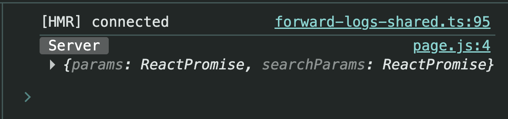
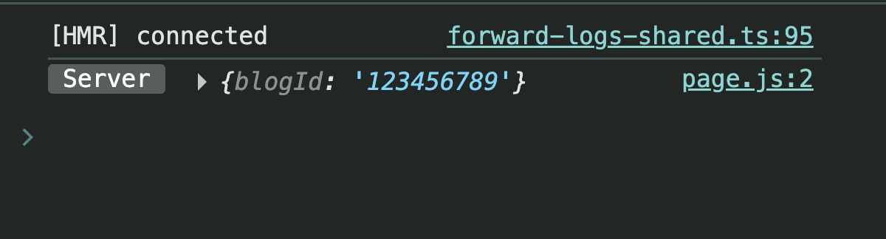

# Next.js Dynamic Routing (App Router)
`app/blogs/[blogId]/page.js`

> A complete beginner-friendly guide to **Dynamic Routing**, `params`, and `searchParams` in **Next.js App Router (Next.js 15+)**.

---

# Introduction

In the **App Router**, every `page.js` receives a **props object**.

```jsx
export default function Blog(props) {
  console.log(props);

  return <h1>Blog Page</h1>;
}
```

When you log `props`, you'll see something like this:

```js
{
    params: Promise,
    searchParams: Promise
}
```

## Screenshot



---

# Understanding the Props Object

The `props` object contains two important properties.

```
props
│
├── params
│      ↓
│   Promise
│
└── searchParams
       ↓
    Promise
```

Both are **Promises** in **Next.js 15+**.

That means you can use

- `await`
- `.then()`
- `.catch()`

---

# Accessing params & searchParams

Since both are promises, make your component `async`.

```jsx
export default async function Blog({ params, searchParams }) {

  console.log(await params);
  console.log(await searchParams);

  return <h1>Blog Page</h1>;
}
```

---

# Visiting

```
/blogs
```

Output

```js
{}
{}
```

## Screenshot


### Why?

Because

- No Dynamic Route exists.
- No Query Parameters exist.

So both return an empty object.

---

# Understanding searchParams

Suppose the URL becomes

```
/blogs?name=sachin
```

Now

```jsx
console.log(await searchParams);
```

returns

```js
{
   name: "sachin"
}
```

while

```jsx
console.log(await params);
```

still returns

```js
{}
```

## Screenshot


---

# What is searchParams?

`searchParams` reads values after the `?`

Example

```
/blogs?name=sachin&page=2&sort=latest
```

becomes

```js
{
    name: "sachin",
    page: "2",
    sort: "latest"
}
```

Think of it like

```
URL

/blogs
   │
   └──── ?name=sachin&page=2

            │
            ▼

searchParams

{
   name: "sachin",
   page: "2"
}
```

---

# But Why Dynamic Routing?

Imagine your website has

- 10 Blogs
- 100 Blogs
- 10,000 Blogs

Will you create

```
app/blogs/blog1
app/blogs/blog2
app/blogs/blog3
app/blogs/blog4
...
```

Absolutely Not.

Instead, Next.js gives us **Dynamic Routing**.

One page can serve **unlimited routes**.

---

# Creating Dynamic Routes

Folder Structure

```
app
│
└── blogs
      │
      └── [blogId]
              │
              └── page.js
```

Notice the folder inside `[]`.

This is called a **Slug**.

---

# Visiting Dynamic URLs

Suppose we visit

```
/blogs/123456789
```

Next.js automatically maps

```
blogId
      ↓
123456789
```

---

# Reading params

```jsx
export default async function Blog({ params }) {

   console.log(await params);

   return <div>Blog</div>;
}
```

Output

```js
{
   blogId: "123456789"
}
```

## Screenshot



---

# Destructuring params

Instead of writing

```jsx
const data = await params;

console.log(data.blogId);
```

simply write

```jsx
export default async function Blog({ params }) {

   const { blogId } = await params;

   return <div>Blog : {blogId}</div>;
}
```

Output

```
Blog : 123456789
```

---

# How Next.js Understands This

```
Folder Name

[blogId]

        │

        ▼

URL

/blogs/123456789

        │

        ▼

params

{
   blogId: "123456789"
}
```

The **folder name becomes the key**, and the **URL segment becomes its value**.

---

# Naming Convention (Best Practice)

Parent folder → **Plural**

```
blogs
products
users
posts
```

Slug folder → **Singular**

```
[blogId]
[productId]
[userId]
[postId]
```

Recommended Structure

```
app
│
├── blogs
│      └── [blogId]
│
├── products
│      └── [productId]
│
└── users
       └── [userId]
```

Although Next.js doesn't enforce this rule, it makes your project much cleaner and easier to understand.

---

# Quick Revision

```
props
│
├── params
│      │
│      └── Dynamic Route
│
└── searchParams
       │
       └── Query Parameters
```

Examples

```
/blogs/101

↓

params

{
   blogId: "101"
}
```

```
/blogs?name=sachin

↓

searchParams

{
   name: "sachin"
}
```

---

# Key Takeaways

- Every `page.js` receives a **props object**.
- `props` contains **params** and **searchParams**.
- In **Next.js 15+**, both are **Promises**.
- Use `await params` and `await searchParams`.
- `searchParams` reads values after `?`.
- `params` reads dynamic route values.
- Dynamic routes are created using square brackets (`[]`).
- The **slug name becomes the key**, and the **URL segment becomes the value**.
- One dynamic page can handle thousands of URLs.
- Prefer **plural** parent folders (`blogs`) and **singular** slug folders (`[blogId]`) for clean project structure.

---

# Final Flow

```text
User Visits URL
        │
        ▼
Next.js Router
        │
        ├───────────────┐
        │               │
        ▼               ▼
Dynamic URL       Query String
/blogs/101        ?name=sachin
        │               │
        ▼               ▼
params        searchParams
        │               │
        ▼               ▼
{ blogId }     { name }
```

---

## Happy Learning!