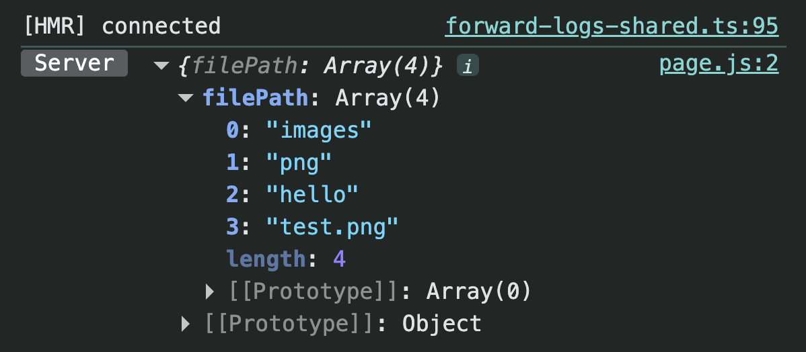
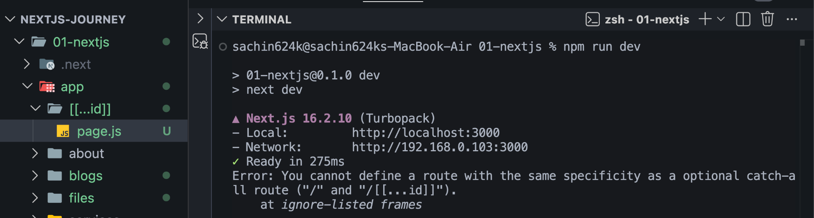

# Catch-all Routes & Optional Catch-all Routes (Next.js App Router)

# Why do we need Catch-all Routes?

Till now we've learned:

- Static Routes
- Dynamic Routes
- Nested Dynamic Routes

All of them are **hardcoded**, meaning we create the folder structure based on how many URL segments we already know.

Example:

```
app
└── blogs
    └── [blogId]
        └── comments
            └── [commentId]
```

This works because we already know the URL structure.

But imagine building a **File Manager**.

Possible URLs:

```
/images/png/test.png
```

```
/images/png/hello/test.png
```

```
/images/png/folder1/folder2/folder3/file.png
```

The number of folders is unknown.

Creating folders for every possible nesting level is impossible.

- That's why **Catch-all Routes** exist.

---

# Required Catch-all Route

Folder Structure

```
app
└── [...filePath]
      └── page.js
```

The three dots (`...`) mean

> Capture every remaining URL segment.

---

## Example

```jsx
export default async function FilePath({ params }) {
  console.log(await params);

  return <div>File</div>;
}
```

Visit

```
/images/png/hello/test.png
```

Console

```js
{
  filePath: ["images", "png", "hello", "test.png"];
}
```

## Screenshot



---

# How It Works

```
URL

/images/png/hello/test.png

        │
        ▼

params

{
  filePath: [
    "images",
    "png",
    "hello",
    "test.png"
  ]
}
```

Every URL segment becomes one element of the array.

---

# Display the Complete Path

```jsx
export default async function FilePath({ params }) {
  const { filePath } = await params;

  return <h1>File /{filePath.join("/")}</h1>;
}
```

Output

```
File /images/png/hello/test.png
```

---

# Route Priority

Suppose you already have

```
app
├── about
│     └── page.js
│
└── [...filePath]
      └── page.js
```

Now visit

```
/about
```

Next.js **will not** open the Catch-all Route.

Instead it opens

```
app/about/page.js
```

because **Static Routes always have higher priority.**

### Route Priority

```
1 Static Routes

/about

        ↓

2 Dynamic Routes

/blogs/[blogId]

        ↓

3 Catch-all Routes

/[...filePath]

        ↓

4 Optional Catch-all Routes

/[[...filePath]]
```

---

# Catch-all Inside a Folder

Instead of catching every route,

you can catch only routes inside a specific folder.

Folder Structure

```
app
└── files
      └── [...filePath]
            └── page.js
```

Now only URLs starting with

```
/files
```

are handled.

Examples

```
/files/images/test.png
```

```
/files/hello/24/demo/file.pdf
```

Output

```js
{
  filePath: ["hello", "24", "demo", "file.pdf"];
}
```

This tells us the user wants to access something inside the **Files** section.

---

# Problem

Now visit

```
/files
```

You'll get

```
404
```

Why?

Because

```
[...filePath]
```

requires **at least one URL segment**.

```
/files/anything
        ↑
Required
```

---

# Optional Catch-all Route

Simply rename

```
[...filePath]
```

to

```
[[...filePath]]
```

Folder Structure

```
app
└── files
      └── [[...filePath]]
            └── page.js
```

Now

```
/files
```

also works.

You **don't need** a separate

```
app/files/page.js
```

if you want the same component to handle both

```
/files
```

and

```
/files/anything
```

---

# Handle Empty Paths

When visiting

```
/files
```

there is no

```
filePath
```

So this

```jsx
filePath.join("/");
```

throws an error.

```jsx
return <h1>File /{filePath.join("/")}</h1>;
```

Use Optional Chaining.

```jsx
export default async function FilePath({ params }) {
  const { filePath } = await params;

  return <h1>File /{filePath?.join("/")}</h1>;
}
```

Now both URLs work

```
/files
```

and

```
/files/images/png/test.png
```

---

# Root Level Conflict

You **can** create

```
app
└── [...filePath]
```

at the root level.

But you **cannot** create

```
app
└── [[...id]]
```

while

```
app/page.js
```

also exists.

Example

```
app
│
├── page.js
│
└── [[...id]]
      └── page.js
```

Next.js throws an error.

## Screenshot



---

# Why?

Both routes can match

```
/
```

```
app/page.js

↓

/
```

and

```
app/[[...id]]

↓

/
```

Next.js doesn't know which page should open.

```
                /

          ┌─────┴─────┐

          ▼           ▼

     page.js     [[...id]]

            Conflict
```

---

# How to Resolve the Conflict?

Delete

```
app/page.js
```

Now

```
app/[[...id]]
```

can handle

```
/
```

and the conflict disappears.

> **Note**
>
> We created
>
> ```
> app/[[...id]]
> ```
>
> only to understand how **Optional Catch-all Routes** work.
>
> After understanding this concept, **delete the `[[...id]]` folder**, because it is only for learning purposes and can conflict with your application's Home Route (`app/page.js`).

---

# Quick Revision

### Required Catch-all

```
[...filePath]
```

Works

```
/files/demo
/files/images/png
/files/a/b/c
```

Does NOT work

```
/files
```

---

### Optional Catch-all

```
[[...filePath]]
```

Works

```
/files
/files/demo
/files/images/png
/files/a/b/c
```

---

# Key Takeaways

- Use **Catch-all Routes** when the number of URL segments is unknown.
- `[...filePath]` captures every remaining URL segment as an array.
- `[[...filePath]]` is the optional version and also works when no segments are provided.
- Static Routes have higher priority than Dynamic, Catch-all, and Optional Catch-all Routes.
- `app/files/[[...filePath]]` can replace `app/files/page.js` if you want a single component to handle both `/files` and `/files/...`.
- Use optional chaining (`?.`) because `filePath` is `undefined` when visiting `/files`.
- Root-level Optional Catch-all Routes conflict with `app/page.js` because both match `/`.
- Create `app/[[...id]]` only to understand the concept, then delete it after learning.
