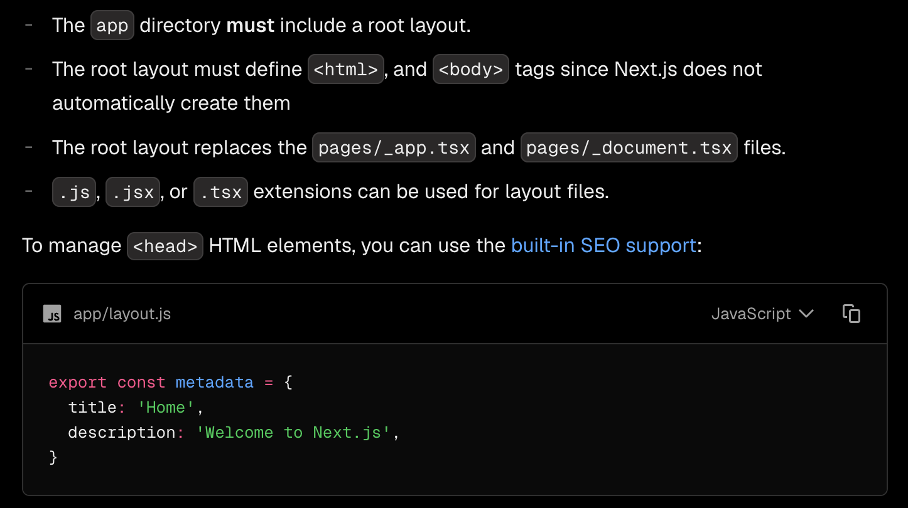
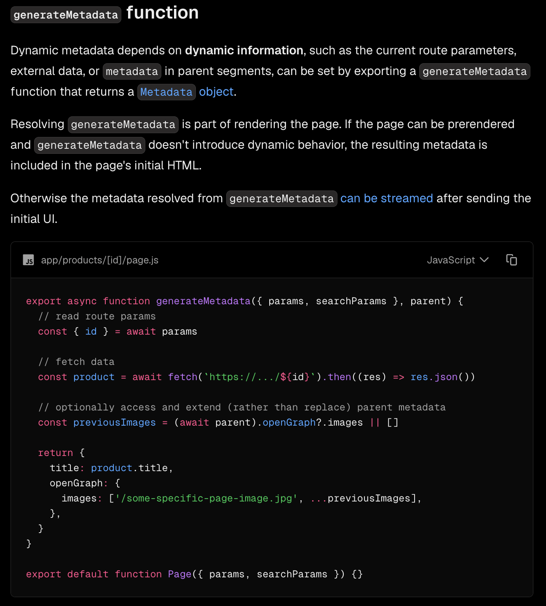

# Metadata API (Next.js App Router)

---

# Why Metadata API?

Earlier, we learned that adding a `<title>` tag directly inside `layout.js` is **not recommended**.

```jsx
<title>Home</title>
```

Why?

Because the title becomes **fixed**.

Even if you visit different pages, the browser title remains the same.

Instead, Next.js provides the **Metadata API** to manage titles, descriptions, SEO tags, Open Graph data, icons, and much more.

---

# Root Metadata

Define metadata inside **Root Layout**.

```jsx
// This metadata is shared by the entire application because it is defined
// in the Root Layout (app/layout.js). Every page inherits it unless it
// overrides the metadata in its own file.

export const metadata = {
  title: "Technical Agency",
};

export default function RootLayout({ children }) {
  return (
    <html>
      <body>
        <header>Header</header>

        {children}

        <footer>Footer</footer>
      </body>
    </html>
  );
}
```

Now every page shows

```
Technical Agency
```

as the browser title.

---

## Screenshot



---

# Page-specific Metadata

If you want a different title for a specific page, export `metadata` from that page.

Example

```jsx
export const metadata = {
  title: "Home | Technical Agency",
};

export default function Home() {
  return <h1>Home</h1>;
}
```

Similarly

```jsx
// about/page.js

export const metadata = {
  title: "About | Technical Agency",
};
```

```jsx
// services/page.js

export const metadata = {
  title: "Services | Technical Agency",
};
```

Each page now has its own browser title.

---

# Using a Title Template

Instead of writing

```jsx
Home | Technical Agency
```

on every page,

create a template in **Root Layout**.

```jsx
export const metadata = {
  title: {
    template: "%s | Technical Agency",
    default: "Technical Agency",
  },
};
```

Now page files become much cleaner.

```jsx
export const metadata = {
  title: "Home",
};
```

```jsx
export const metadata = {
  title: "About",
};
```

```jsx
export const metadata = {
  title: "Services",
};
```

Generated titles

```
Home | Technical Agency
```

```
About | Technical Agency
```

```
Services | Technical Agency
```

If no page title is provided, Next.js uses

```
Technical Agency
```

(the `default` value).

---

# Dynamic Metadata

Static metadata works well for static pages.

But what about Dynamic Routes?

Example

```
/blogs/24
```

If we write

```jsx
export const metadata = {
  title: "Blog",
};
```

the title is always

```
Blog
```

We cannot access

```
blogId
```

using static metadata.

---

# generateMetadata()

For dynamic routes, use

```jsx
export async function generateMetadata({ params }) {

  const { blogId } = await params;

  return {
    title: `Blog ${blogId}`,
  };
}
```

Page

```jsx
export default async function Blog({ params }) {

  const { blogId } = await params;

  return <h1>Blog: {blogId}</h1>;
}
```

Now

```
/blogs/24
```

shows

```
Blog 24
```

---

## Screenshot



---

# Why generateMetadata()?

Unlike

```jsx
export const metadata = {}
```

`generateMetadata()` can access

- Route Parameters
- Search Parameters
- API Data
- Database Data

because it runs at request/render time.

That's why it's used for dynamic pages.

---

# Absolute Title

Sometimes you don't want to use the template.

Example

Root Layout

```jsx
title: {
  template: "%s | Technical Agency",
  default: "Technical Agency",
}
```

Suppose a page should display

```
My Files
```

instead of

```
My Files | Technical Agency
```

Use

```jsx
export const metadata = {
  title: {
    absolute: "My Files",
  },
};
```

Output

```
My Files
```

The template is ignored.

---

# Metadata Hierarchy

```
Root Layout Metadata

        │

        ▼

Inherited by

All Pages

        │

        ▼

Page Metadata

(overrides Root Metadata)

        │

        ▼

generateMetadata()

(overrides dynamically)
```

---

# Metadata API Can Also Manage

Besides the page title, the Metadata API can also generate:

- Description
- Keywords
- Icons (favicon)
- Open Graph Tags

and many more.

> Explore the official Next.js documentation to learn all available metadata options.

---

# Key Takeaways

- Never use the `<title>` tag directly inside `layout.js`.
- Use `export const metadata` for static page metadata.
- Metadata defined in `app/layout.js` is inherited by all pages.
- Individual pages can override Root Metadata.
- Use `title.template` to avoid repeating the site name.
- Use `generateMetadata()` for dynamic routes because it can access `params`, `searchParams`, and fetched data.
- Use `title.absolute` when you don't want to use the template.
- The Metadata API also supports SEO tags, Open Graph, Twitter Cards, icons, and much more.