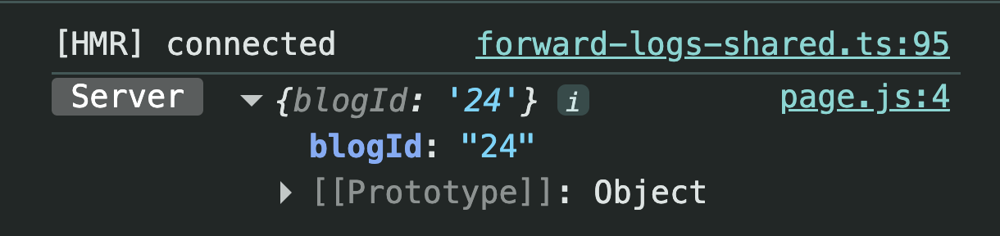
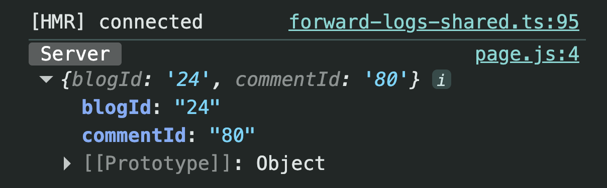
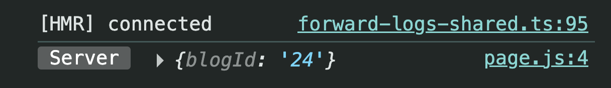

# Nested Dynamic Routing (Next.js App Router)

---

# What is Nested Dynamic Routing?

Nested Dynamic Routing means creating **dynamic routes inside another dynamic route**.

Instead of handling only one dynamic value, we can handle multiple values from the URL.

Example:

```
/blogs/24/comments/80
```

Here,

- `24` → Blog ID
- `80` → Comment ID

Both values are available inside `params`.

---

# Why do we need it?

Suppose we already have blogs.

```
/blogs/24
```

Now every blog contains hundreds of comments.

We don't just want to show all comments.

Sometimes we want to open a **specific comment**.

Example:

```
/blogs/24/comments/80
```

Without Nested Dynamic Routing, this wouldn't be possible.

---

# Parent Route

Folder Structure

```
app
│
└── blogs
     │
     └── [blogId]
            │
            └── comments
                    │
                    └── page.js
```

Visit

```
/blogs/24/comments
```

Code

```jsx
export default async function Comments({ params }) {
  const paramsObj = await params;

  console.log(paramsObj);

  return <div>Comments Page</div>;
}
```

Output

```js
{
  blogId: "24";
}
```

## Screenshot



---

# Need a Specific Comment?

Suppose we want to open

Comment **80** of Blog **24**.

URL

```
/blogs/24/comments/80
```

Now we need another dynamic folder.

---

# Child Dynamic Route

Folder Structure

```
app
│
└── blogs
     │
     └── [blogId]
            │
            └── comments
                   │
                   └── [commentId]
                           │
                           └── page.js
```

This is called **Nested Dynamic Routing**.

---

# Accessing Multiple Params

```jsx
export default async function Comment({ params }) {
  const paramsObj = await params;

  const { blogId, commentId } = paramsObj;

  console.log(paramsObj);

  return (
    <div>
      Comment no. <i>{commentId}</i> on <b>{blogId}</b> page.
    </div>
  );
}
```

---

# Visiting

```
/blogs/24/comments/80
```

Output

```js
{
   blogId: "24",
   commentId: "80"
}
```

## Screenshot



---

# How Next.js Maps the URL

```
URL

/blogs/24/comments/80

       │
       ▼

Folder Structure

blogs
 └── [blogId]
        └── comments
               └── [commentId]

       │
       ▼

params

{
   blogId: "24",
   commentId: "80"
}
```

Notice

- `blogId` comes from the parent dynamic folder.
- `commentId` comes from the child dynamic folder.

---

# Parent Route vs Child Route

### Parent Route

```
/blogs/24/comments
```

Returns

```js
{
  blogId: "24";
}
```

## Screenshot



---

### Child Route

```
/blogs/24/comments/80
```

Returns

```js
{
   blogId: "24",
   commentId: "80"
}
```

The child route automatically includes the parent's params.

---

# Route Flow

```text
/blogs/24/comments/80
        │
        ▼
blogs
        │
        ▼
[blogId]
        │
        ▼
comments
        │
        ▼
[commentId]
        │
        ▼
page.js
        │
        ▼
params

{
   blogId: "24",
   commentId: "80"
}
```

---

# Remember

Every dynamic folder contributes one key to `params`.

Example

```
[blogId]
```

↓

```js
{
  blogId: "24";
}
```

Another dynamic folder

```
[commentId]
```

↓

```js
{
  commentId: "80";
}
```

Together

```js
{
   blogId: "24",
   commentId: "80"
}
```

---

# Key Takeaways

- Dynamic routes can be nested inside other dynamic routes.
- Each dynamic folder (`[]`) adds one key to `params`.
- Parent dynamic params are automatically available in child routes.
- `/blogs/24/comments` returns only `blogId`.
- `/blogs/24/comments/80` returns both `blogId` and `commentId`.
- Use `await params` in Next.js 15+ because `params` is a Promise.
