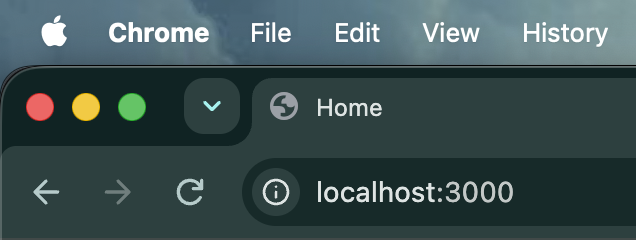
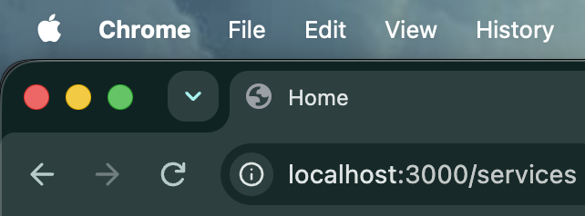

# Reusable Layouts (Next.js App Router)

> app/services/layout.js

---

# What is a Layout?

A Layout is a component that wraps one or more pages.

Instead of repeating common UI like

- Header
- Footer
- Sidebar
- Navigation

on every page, we place them inside a Layout.

```
Layout

┌────────────────────┐
│ Header             │
├────────────────────┤
│                    │
│     Page           │
│                    │
├────────────────────┤
│ Footer             │
└────────────────────┘
```

The page content changes, but the layout remains the same.

---

# Root Layout

Every Next.js App Router project must have a Root Layout.

```
app
│
├── layout.js
└── page.js
```

Example

```jsx
export default function RootLayout({ children }) {
  return (
    <html>
      <body>
        <header style={{ background: "lightgreen" }}>
          Header
        </header>

        {children}

        <footer style={{ background: "skyblue" }}>
          Footer
        </footer>
      </body>
    </html>
  );
}
```

Here,

```
children
```

represents the current page being rendered.

Example

```
Home Page

↓

Root Layout

↓

Header

↓

Home Page

↓

Footer
```

---

# Root Layout Applies Everywhere

Suppose your project has

```
app
│
├── page.js
├── about
│     └── page.js
└── services
      └── page.js
```

The Root Layout automatically wraps **every page**.

```
Home

↓

Header

↓

Home Page

↓

Footer
```

```
About

↓

Header

↓

About Page

↓

Footer
```

```
Services

↓

Header

↓

Services Page

↓

Footer
```

---

# Nested (Reusable) Layout

Sometimes one section of the application needs its own layout.

Example

```
app
│
└── services
      ├── layout.js
      └── page.js
```

```jsx
export default function ServicesLayout({ children }) {
  return (
    <section>
      <h3>Services Layout</h3>

      {children}
    </section>
  );
}
```

Now only the **Services** pages use this layout.

---

# How Nested Layouts Work

When visiting

```
/services
```

Next.js renders

```
Root Layout

↓

Header

↓

Services Layout

↓

Services Page

↓

Footer
```

Visual Flow

```
Root Layout
│
├── Header
│
├── Services Layout
│      │
│      └── Services Page
│
└── Footer
```

---

# HTML & BODY Rule

Only the **Root Layout** should contain

```html
<html>
```

and

```html
<body>
```

Example

Root Layout

```jsx
<html>
  <body>
    {children}
  </body>
</html>
```

Nested Layout

```jsx
<section>
  {children}
</section>
```

Don't do this

```jsx
<html>
  <body>
     ...
  </body>
</html>
```

inside

```
services/layout.js
```

### Why?

Because the Root Layout is rendered first, and every other layout is rendered **inside** it.

```
Root Layout

↓

Nested Layout

↓

Page
```

So only one `<html>` and one `<body>` should exist in the application.

---

# Don't Use `<title>` Inside Layout

Example

```jsx
export default function RootLayout({ children }) {
  return (
    <html>
      <body>

        <title>Home</title>

        {children}

      </body>
    </html>
  );
}
```

This is **not recommended** in Next.js.

### Why?

Because the title becomes **fixed**.

Even if you navigate to different pages, the browser title never changes.

For example:

### Home Page (`/`)

The browser title is

```
Home
```



---

### Services Page (`/services`)

Even after navigating to the Services page, the browser title is **still**

```
Home
```

instead of something like

```
Services
```



---

This happens because

```jsx
<title>Home</title>
```

is hardcoded inside the Root Layout.

Since the Root Layout wraps every page, every route inherits the same title.

```
Root Layout

↓

<title>Home</title>

↓

Home Page
About Page
Services Page

↓

Browser Title

Home
```

That's why Next.js recommends using the **Metadata API** to generate page-specific titles dynamically.

We'll learn the Metadata API in the next topic.

---

# Key Takeaways

- Every App Router project must have a **Root Layout**.
- Root Layout wraps every page in the application.
- Use Nested Layouts to share UI within a specific section.
- `children` represents the current page being rendered.
- Only the Root Layout should contain `<html>` and `<body>`.
- Do **not** add `<html>` or `<body>` inside nested layouts.
- Avoid using `<title>` directly inside a layout because it creates a fixed title.
- Use the **Metadata API** for dynamic page titles (covered in the next topic).