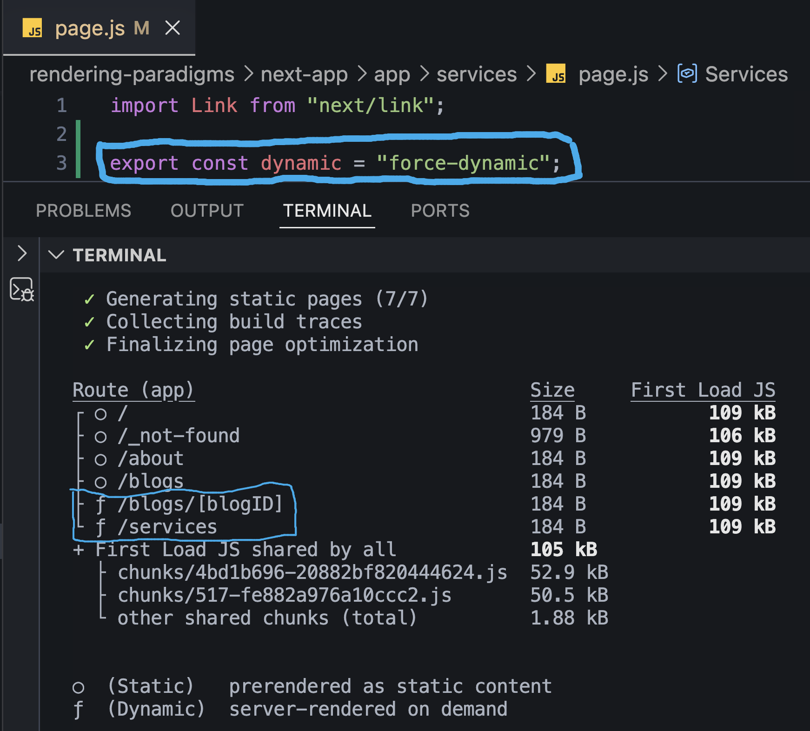
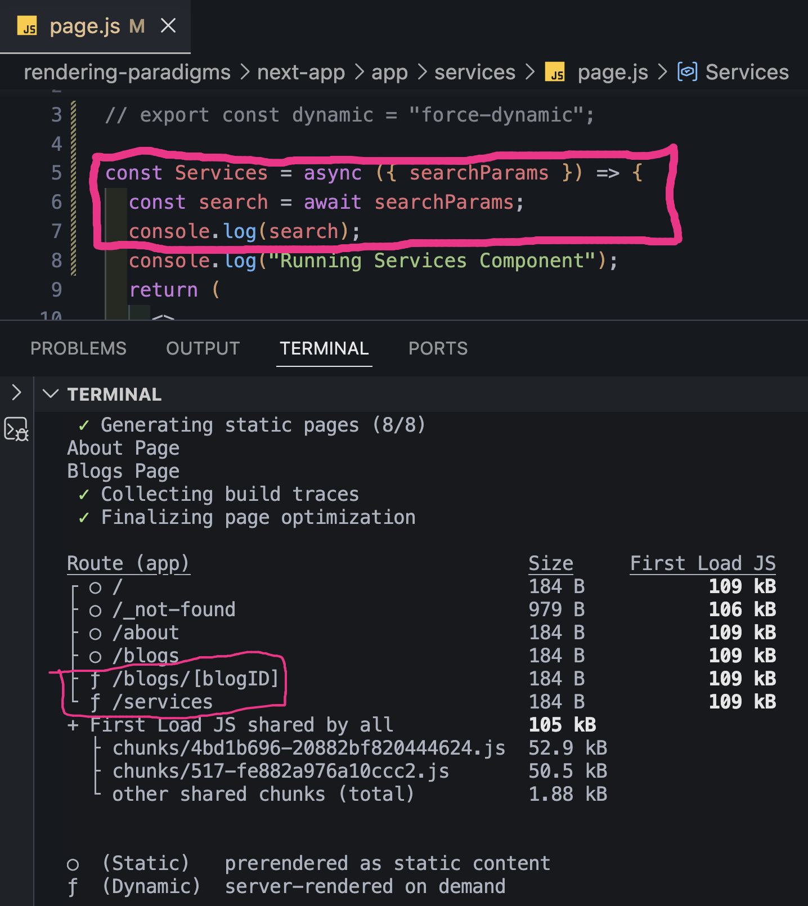
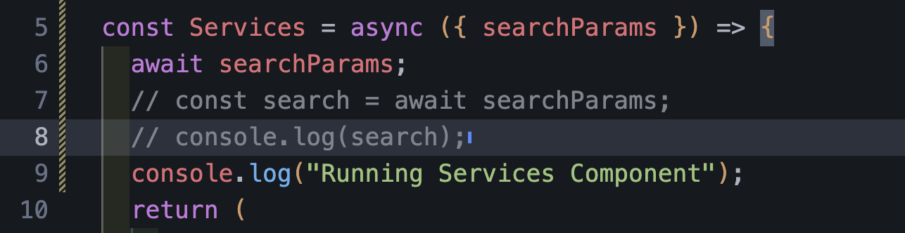

# Force Dynamic Rendering of Static Pages in Next.js

## Introduction

By default, Next.js tries to statically render pages whenever possible because static pages are faster.

For example,

```
app/
├── about/page.js
├── services/page.js
└── blogs/page.js
```

All these pages are prerendered during the build process.

```
npm run build
```

↓

```
Static HTML Generated
```

↓

```
Fast Response
```

---

# Can We Force a Static Page to Become Dynamic?

Yes.

Even if a route is completely static,

we can force Next.js to render it dynamically.

There are multiple ways to do this.

---

# Method 1 — `dynamic = "force-dynamic"`

The easiest way is:

```jsx
export const dynamic = "force-dynamic";
```

Example

```jsx
export const dynamic = "force-dynamic";

export default function Services() {
  return <h1>Services</h1>;
}
```

Now build the project.

```bash
npm run build
```

Notice the output.



Earlier,

```
○ /services
```

Now,

```
ƒ /services
```

Meaning

Next.js will render this page on every request.

---

# Method 2 — Using `searchParams`

Suppose we receive query parameters.

Example

```jsx
const Services = async ({ searchParams }) => {
  const search = await searchParams;

  console.log(search);

  return <h1>Services</h1>;
};
```

The page now depends on request-specific query parameters.

Example

```
/services?category=web

/services?category=mobile
```

Each request may produce a different response.

Because of this,

Next.js renders the page dynamically.

Example



---

# Method 3 — Using `cookies()`

Next.js also provides

```jsx
import { cookies } from "next/headers";
```

Example

```jsx
import { cookies } from "next/headers";

const Services = async () => {
  const myCookies = await cookies();

  console.log(myCookies);

  return <h1>Services</h1>;
};
```

Cookies are different for every user.

Because the response depends on request-specific cookies,

Next.js cannot generate one HTML file during build.

Therefore,

the page automatically becomes dynamic.

Example



---

# Other APIs That Make a Route Dynamic

Next.js also switches to Dynamic Rendering when using request-specific APIs such as:

```jsx
headers();
```

```jsx
cookies();
```

or

```jsx
export const dynamic = "force-dynamic";
```

These APIs require information from the incoming request, so the page must be rendered on demand.

---

# Static vs Force Dynamic

| Static Rendering         | Force Dynamic Rendering           |
| ------------------------ | --------------------------------- |
| Generated during build   | Generated on every request        |
| Faster                   | Slightly slower                   |
| Best for fixed content   | Best for request-specific content |
| HTML stored during build | HTML generated on demand          |

---

# When Should We Use Dynamic Rendering?

Dynamic Rendering is useful when the page depends on request-specific data such as:

- User authentication
- Cookies
- Search parameters
- Request headers
- Personalized dashboards
- User profiles
- Shopping carts

---

# Key Takeaways

- Next.js statically renders pages whenever possible.
- `export const dynamic = "force-dynamic"` forces a page to be rendered on every request.
- Reading request-specific values like `cookies()` or `headers()` automatically makes a route dynamic.
- Pages that depend on request data cannot be safely prerendered because each user may receive different content.
