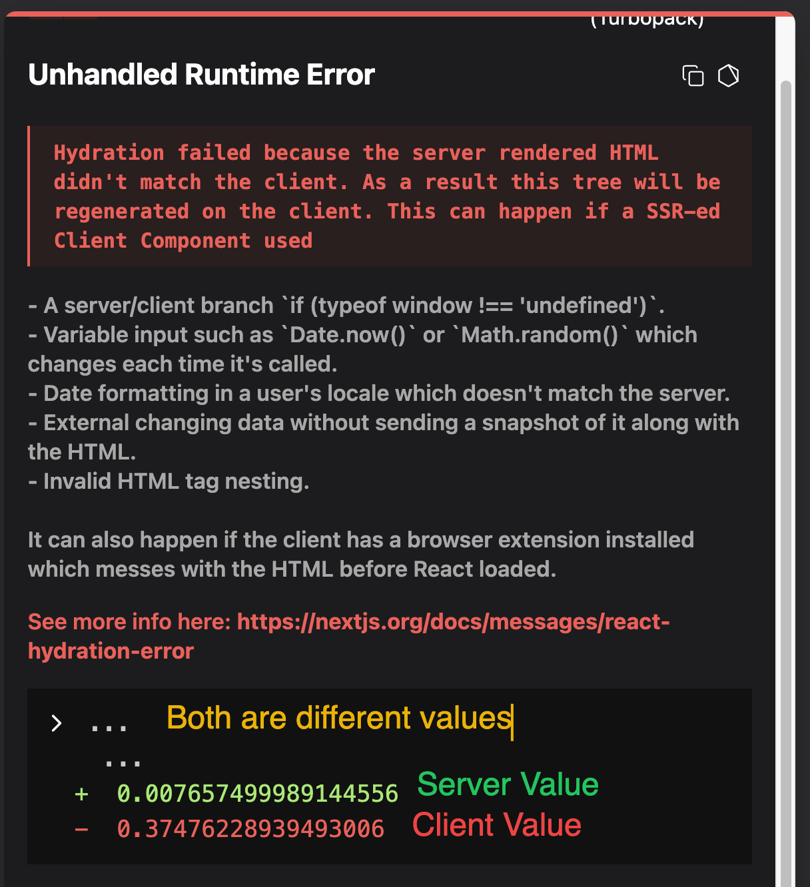

# Hydration in Next.js

## What is Hydration?

Hydration is the process of making a **pre-rendered HTML page interactive** by attaching JavaScript event listeners and React logic in the browser.

In simple words,

```
Server generates HTML
        │
        ▼
Browser displays HTML instantly
        │
        ▼
JavaScript loads
        │
        ▼
React attaches event listeners
        │
        ▼
Page becomes interactive
```

This entire process is called **Hydration**.

---

# Why is Hydration Needed?

Suppose we have a button.

```jsx
"use client";

export default function Button() {
  return (
    <button onClick={() => console.log("Button Clicked")}>Click Me</button>
  );
}
```

Used inside

```jsx
app / blogs / page.js;
```

Initially,

Next.js renders

```html
<button>Click Me</button>
```

on the **server**.

This HTML is immediately sent to the browser.

The browser can display the button,

but...

```
Nothing is clickable yet.
```

Why?

Because HTML only contains

```
Structure
```

It does NOT contain

```
JavaScript
Event Listeners
React State
Hooks
```

---

# What Happens Next?

Along with HTML,

Next.js also sends JavaScript for all Client Components.

When JavaScript finishes loading,

React executes

```jsx
onClick();
```

and attaches the click event to the button.

Now

```
Button becomes interactive.
```

This is Hydration.

---

# Complete Flow

```
Server

↓

Render HTML

↓

Send HTML to Browser

↓

Browser displays page instantly

↓

Download JavaScript

↓

React Hydrates

↓

Attach Event Listeners

↓

Interactive Website
```

---

# Example

Button Component

```jsx
"use client";

export default function Button() {
  return <button onClick={() => console.log("Clicked")}>Click Me</button>;
}
```

During rendering

Server sends

```html
<button>Click Me</button>
```

Later,

React executes

```jsx
onClick();
```

inside the browser.

Now clicking the button prints

```
Clicked
```

---

# Why Can't Server Attach Event Listeners?

Server has

- No Browser
- No DOM
- No Mouse
- No Keyboard
- No Click Events

Server only knows how to generate HTML.

Only the browser can attach

```
onclick
mousemove
keydown
submit
change
```

events.

That's why Hydration happens in the browser.

---

# Does Hydration Only Happen for use client Components?

**No.**

This is a very common misunderstanding.

Hydration is **not only about event listeners.**

React also hydrates the application so that the React tree on the client matches the HTML generated by the server.

Whenever a page contains Client Components, React hydrates those parts.

Even if your page has no custom button or `onClick`, Next.js may still hydrate parts of the application (for example, routing with `<Link />` or other client-side React logic).

A page that is **100% Server Components with only static HTML** requires little or no client-side React for that content, but the Next.js application itself still loads the minimal runtime needed for navigation and other framework features.

---

# What if We Remove "use client" from Button?

Suppose

```jsx
export default function Button() {
    return (
        <button onClick={...}>
            Click
        </button>
    )
}
```

Next.js immediately throws an error.

Why?

Because

```
Server Components
```

cannot use

- onClick
- useState
- useEffect
- Browser APIs

These require JavaScript in the browser.

Only Client Components support them.

---

# Why Does Link Work Without Writing use client?

Many beginners ask

> Link bhi click hota hai...
>
> Fir vo kaise kaam karta hai?

Because

```
next/link
```

is already implemented by Next.js.

Internally,

it contains the client-side code required for navigation.

You don't need to write

```jsx
"use client";
```

just to use `<Link />`.

---

# What is a Hydration Error?

Hydration Error means

```
HTML generated on the server

≠

HTML generated on the browser
```

Both must be exactly the same.

If they differ,

React shows

```
Hydration Failed
```

---

# Why Does This Error Occur?

Example

```jsx
"use client";

export default function Comments() {
  if (typeof window === "undefined") {
    return <div>500 Comments Server</div>;
  }

  return <div>500 Comments Client</div>;
}
```

Server renders

```
500 Comments Server
```

Browser renders

```
500 Comments Client
```

React compares

```
Server HTML

↓

500 Comments Server
```

with

```
Client HTML

↓

500 Comments Client
```

They don't match.

Therefore

```
Hydration Error
```

occurs.

---

# Why Is This a Problem?

Imagine the user sees

```
500 Comments Server
```

for a fraction of a second.

Then suddenly

```
500 Comments Client
```

appears.

The UI changes after the page is already visible.

This creates

- Flickering
- Layout Shift
- Poor User Experience

That's why React warns you.

---

# Another Example

```jsx
"use client";

export default function Comments() {
  return <div>{Math.random()}</div>;
}
```

Server

```
0.007657
```

Browser

```
0.374762
```

They are different.

Exactly like your screenshot.

Therefore

```
Hydration Failed
```

appears.

---

## Hydration Error Example

The following screenshot shows a hydration mismatch caused by
`Math.random()`. The server and client generated different values,
so React detected that the HTML did not match.



---

# Date.now() Also Causes Hydration Errors

Example

```jsx
<div>{Date.now()}</div>
```

Server

```
1721083500000
```

Browser

```
1721083500523
```

Different values.

Again

```
Hydration Error
```

---

# Common Causes of Hydration Errors

- `Math.random()`
- `Date.now()`
- `new Date()`
- Browser extensions modifying the DOM
- Rendering different JSX on server and client
- Invalid HTML nesting
- Browser-only APIs during rendering (`window`, `document`, `localStorage`)
- Data that changes before hydration completes

---

# Browser Extension Example

Sometimes,

your code is completely correct,

but you still see

```
Hydration Failed
```

Why?

Because some browser extensions

- Dark Reader
- Grammarly
- Ad Blockers
- Password Managers

modify the HTML before React hydrates it.

Now

Server HTML

≠

Browser HTML

Result

```
Hydration Error
```

If you open the same page in

- Incognito Mode
- Another Browser
- Disable Extensions

the error usually disappears.

> **Note:** In development mode, React shows detailed hydration warnings to help you debug. In production, these warnings are hidden, but the mismatch still exists and React will recover by re-rendering the affected part of the UI. The underlying problem should still be fixed.

---

# Why Does React Compare Server HTML with Client HTML?

Because React must know

```
Can I safely reuse the HTML already on the page?

OR

Do I need to throw it away and render again?
```

If everything matches,

Hydration succeeds instantly.

If not,

React discards the mismatched tree

and renders it again on the client.

This is slower and may cause visible UI changes.

---

# Best Practices

- Keep Server and Client output identical.

- Don't use `Math.random()` during render.

- Don't use `Date.now()` during render.

- Don't conditionally render different JSX using `typeof window`.

- Use `useEffect()` for browser-only logic.

- Access `window`, `document`, and `localStorage` only inside Client Components, and preferably inside effects or guarded checks.

---

# Complete Hydration Flow

```
Server

↓

React Components

↓

Generate HTML

↓

Send HTML

↓

Browser shows page instantly

↓

Download JavaScript

↓

React compares Server HTML with Client HTML

↓

If Same

↓

Attach Event Listeners

↓

Hydration Successful

----------------------------------------

If Different

↓

Hydration Failed

↓

React re-renders on the client

↓

Possible UI Flicker
```

---

# Key Takeaways

- Hydration is the process of attaching React and JavaScript behavior to server-rendered HTML.
- The server generates HTML, but the browser makes it interactive.
- Client Components are hydrated because they contain browser-side React logic.
- Hydration succeeds only when the HTML generated by the server matches the HTML generated by the client.
- Differences caused by `Math.random()`, `Date.now()`, browser-only APIs, or conditional rendering lead to hydration errors.
- Browser extensions can also modify the DOM before hydration and trigger these errors.
- Development mode shows hydration warnings; production recovers automatically, but mismatches should still be fixed.
