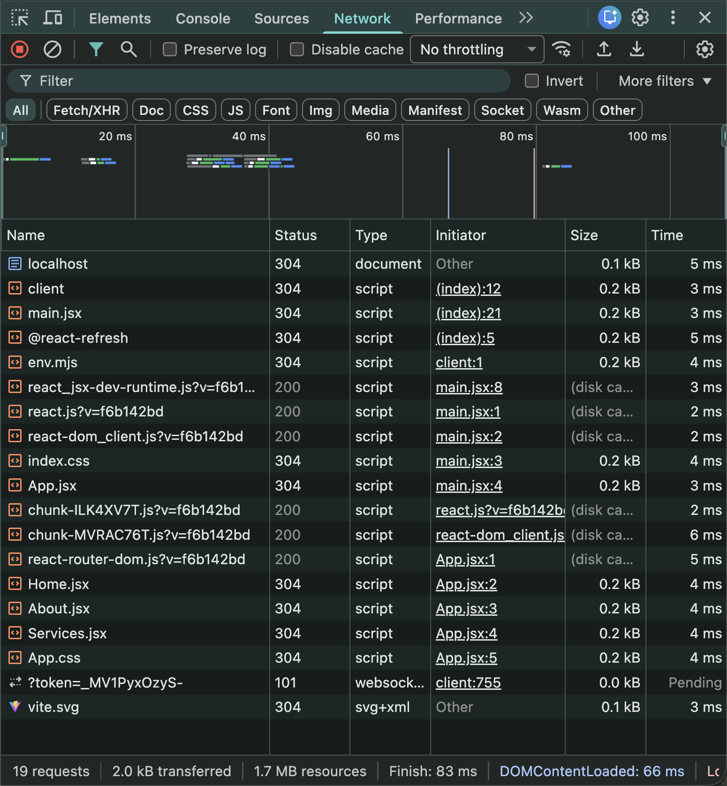
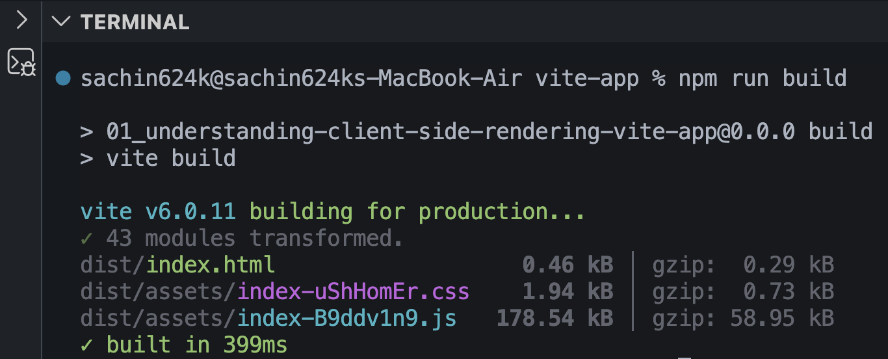
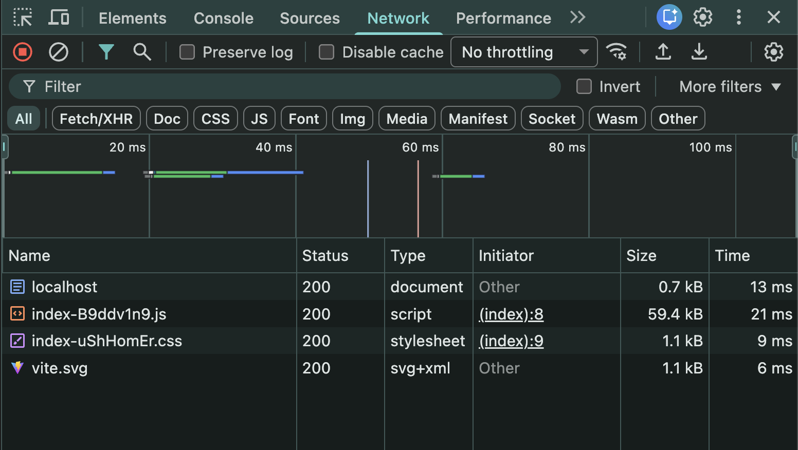
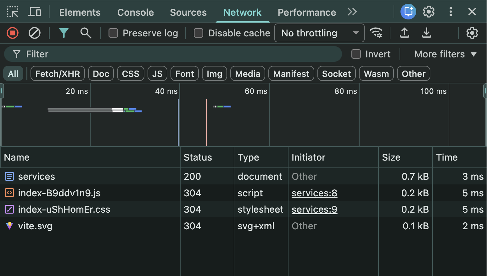
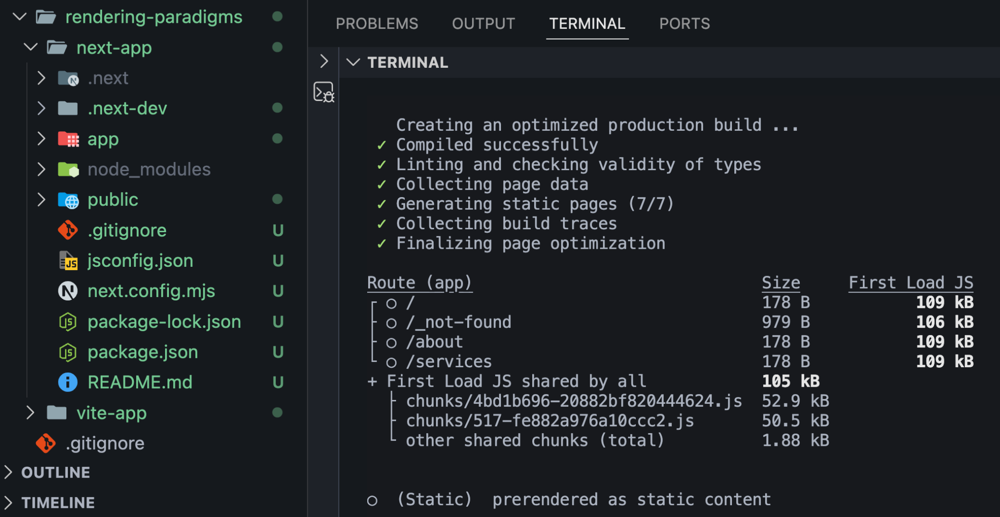
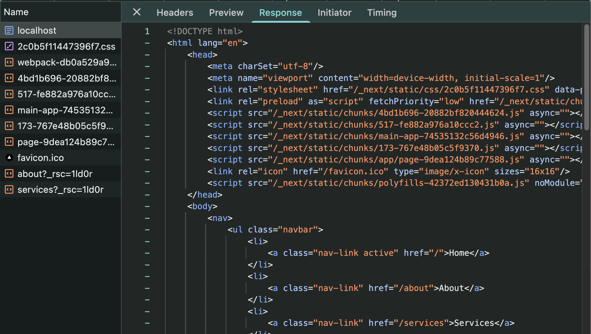
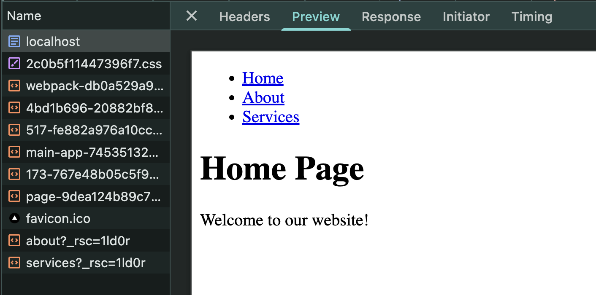
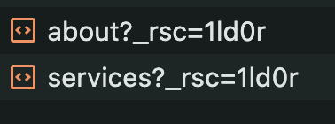
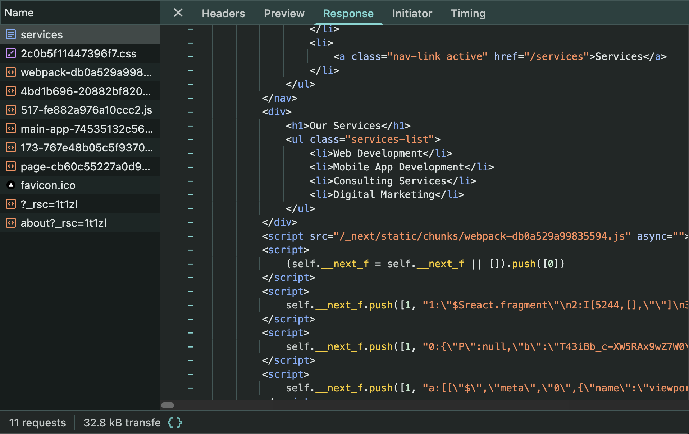

# Rendering Paradigms (Next.js)

---

# What is Rendering?

Rendering means converting your React components into **HTML** so that the browser can display them.

The biggest question is:

> **Where is this HTML generated?**

There are only **two possible places**.

- Server
- Client (Browser)

---

# Client-side vs Server-side Rendering

## Client-side Rendering (CSR)

HTML is generated inside the **browser** using JavaScript.

Examples

- React (Vite)
- Create React App (CRA)

### Advantages

- Fast client-side navigation
- Rich user interactions

### Disadvantages

- Poor SEO
- Blank page until JavaScript loads
- Slower first page load

---

## Server-side Rendering (SSR)

HTML is generated on the **server** and sent directly to the browser.

Examples

- Express (EJS)
- Next.js SSR

### Advantages

- Better SEO
- Faster first meaningful paint
- Browser immediately receives HTML

### Disadvantages

- Server renders the page for every request

---

# Why Next.js?

React mainly supports

- Client-side Rendering (CSR)

Express mainly provides

- Server-side Rendering (SSR)

Next.js combines **both** approaches and lets us choose the best rendering strategy for each page.

---

# Rendering Strategies Supported by Next.js

Next.js supports multiple rendering paradigms.

- Client-side Rendering (CSR)
- Server-side Rendering (SSR)
- Static Site Generation (SSG)
- Incremental Static Regeneration (ISR)
- React Server Components (RSC)
- Streaming
- Partial Prerendering (PPR)
- Suspense
- Edge Rendering

> **SSG** and **ISR** are also server-side rendering techniques because the HTML is generated on the server.

---

# React (Vite) Development Mode

During development, React doesn't bundle everything into one file.

Instead, it serves multiple JavaScript files separately.

Examples

- App.jsx
- Home.jsx
- About.jsx
- Services.jsx
- react.js
- react-dom.js
- index.css

This makes development much faster because only the changed file is reloaded.

## Screenshot



---

# React (Vite) Production Build

Build the application

```bash
npm run build
```

A **dist** folder is generated.

Run the production server

```bash
npm run preview
```

Now open the **Network** tab.

You'll notice only a few files are downloaded.

- HTML
- JavaScript Bundle
- CSS
- favicon

Instead of sending dozens of JavaScript files, Vite bundles everything together.

## Screenshot



---

# React Production Network

In production only a few requests are sent.

```
HTML

↓

JavaScript Bundle

↓

CSS

↓

favicon
```

## Screenshot



---

# Client-side Navigation (React)

Suppose you're on

```
/
```

Now click

```
About
```

or

```
Services
```

No new HTML request is made.

React Router simply updates the UI using the already downloaded JavaScript bundle.

Everything happens inside the browser.

## Screenshot



When you refresh the page,

only then does the browser request a new HTML document.

---

# Next.js Production Build

Next.js also has two modes.

Development

```bash
npm run dev
```

Production

```bash
npm run build
npm start
```

During the production build, Next.js creates a

```
.next
```

folder.

This folder is similar to React's

```
dist
```

folder.

It contains all optimized production assets.

## Screenshot



---

# Next.js HTML Response

Open the Network tab and inspect the **Document (localhost)** request.

Unlike React,

the Response already contains a complete HTML page.

## Screenshot



Notice that the HTML already includes

- Navbar
- Headings
- Content

The browser simply displays it because the server has already rendered everything.

This greatly improves

- SEO
- First page load
- Social media previews

---

# HTML Preview

If you switch to the **Preview** tab in Chrome DevTools, you'll see the rendered HTML exactly as returned by the server.

This confirms that the page was already rendered **before reaching the browser**.

Unlike React (CSR), the browser doesn't need to generate the initial HTML using JavaScript.

## Screenshot



---

# React vs Next.js

## React (CSR)

```
Browser

↓

Downloads JavaScript

↓

Runs React

↓

Generates HTML

↓

Displays UI
```

---

## Next.js (SSR)

```
Browser

↓

Requests Page

↓

Server Generates HTML

↓

Browser Receives Ready HTML

↓

Displays UI
```

---

# Initial Page Load

Suppose you first visit

```
/
```

The browser sends a request to the server.

```
Browser

↓

GET /

↓

Next.js Server
```

The server returns

- Home page HTML
- CSS
- JavaScript
- React Server Component (RSC) payload for the current route

The browser can immediately display the page because the HTML already exists.

Unlike React, the browser doesn't need to build the initial HTML using JavaScript.

---

# React Server Components (RSC)

While inspecting the Network tab, you may notice requests ending with

```
?_rsc=...
```

Examples

```
about?_rsc=...

services?_rsc=...
```

These are **React Server Component (RSC)** requests.

They are **not HTML pages**.

Instead, they contain serialized server-rendered component data that React understands.

This allows Next.js to update only the changed parts of the page without downloading another HTML document.

## Screenshot



---

# RSC Response

Open any request ending with

```
?_rsc=...
```

and inspect the **Response** tab.

You'll notice that it doesn't contain HTML.

Instead, it contains a special **React Server Component payload**.

React reads this payload and updates only the components that changed.

## Screenshot



This makes page navigation extremely fast.

---

# Client-side Navigation in Next.js

Suppose you're currently on

```
/
```

Now click

```
About
```

The browser **does not download another HTML page**.

Instead, Next.js requests only the React Server Component payload.

```
Browser

↓

GET /about?_rsc=...

↓

Server

↓

Returns About RSC Payload

↓

React updates only the changed UI
```

No full page reload occurs.

The same process happens when navigating to

```
Services
```

Only the required RSC payload is downloaded.

---

# HTML vs RSC (Most Important)

When you first visit

```
/
```

the browser receives

- HTML of the Home page
- CSS
- JavaScript

The Home page is displayed immediately because the server already rendered it.

```
Browser

↓

GET /

↓

Server

↓

Home HTML

+

CSS

+

JavaScript
```

---

Now suppose you click

```
/about
```

The browser **does not request another HTML page**.

Instead, it requests

```
about?_rsc=...
```

The server returns only the About page's React Server Component payload.

React merges that payload into the existing application and updates only the changed UI.

```
Home

↓

Click About

↓

GET about?_rsc=...

↓

Server

↓

About RSC Payload

↓

React updates UI

↓

No Full Page Reload
```

The exact same process happens for

```
/services
```

Only the Services RSC payload is downloaded.

This approach gives Next.js

- Better SEO
- Faster page navigation
- Less unnecessary data transfer
- Better performance

---

# React vs Next.js Navigation

| React (CSR)                   | Next.js App Router            |
| ----------------------------- | ----------------------------- |
| HTML generated in browser     | HTML generated on server      |
| Browser builds first page     | Browser receives ready HTML   |
| Uses React Router             | Uses React Server Components  |
| JavaScript handles everything | Server + Client work together |
| Poor SEO                      | Excellent SEO                 |
| Slower first page load        | Faster first page load        |

---

# Key Takeaways

- Rendering means converting React components into HTML.
- HTML can be generated on the client or on the server.
- React (Vite) mainly uses Client-side Rendering.
- Express mainly provides Server-side Rendering.
- Next.js combines both approaches.
- Next.js supports CSR, SSR, SSG, ISR, RSC, Streaming, PPR, and more.
- Development mode is optimized for developers, not performance.
- Production bundles and optimizes the application.
- React generates HTML in the browser.
- Next.js sends pre-rendered HTML from the server.
- During navigation, Next.js requests only the required React Server Component (RSC) payload instead of downloading another HTML page.
- Server-rendered HTML improves SEO and provides a much faster initial page load.
