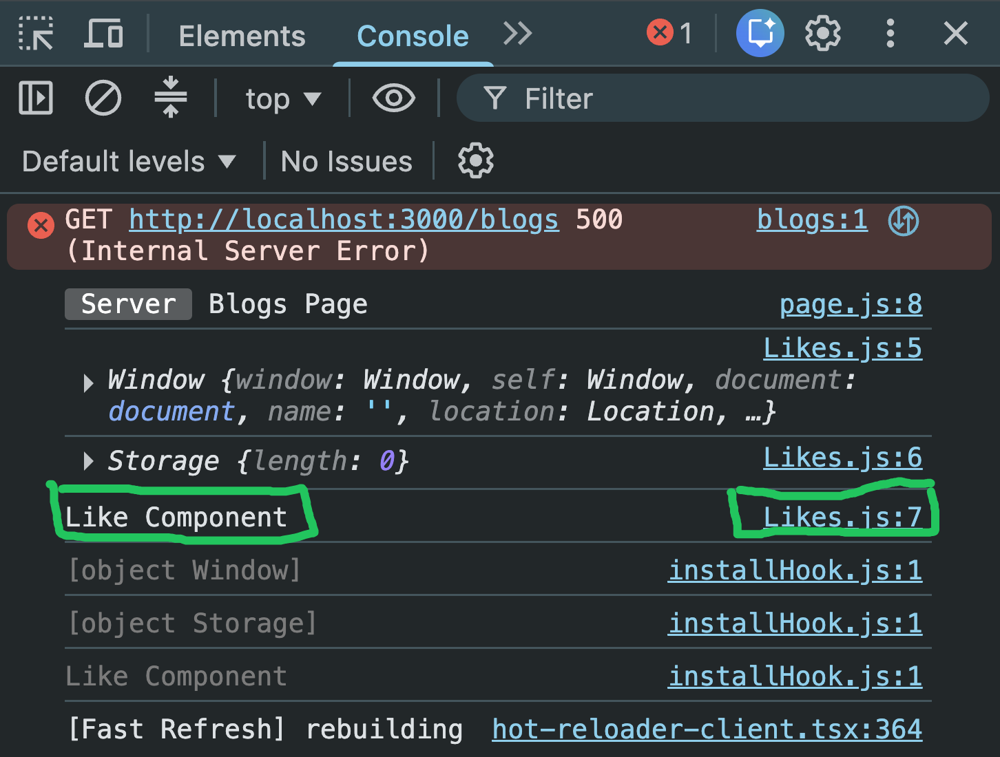
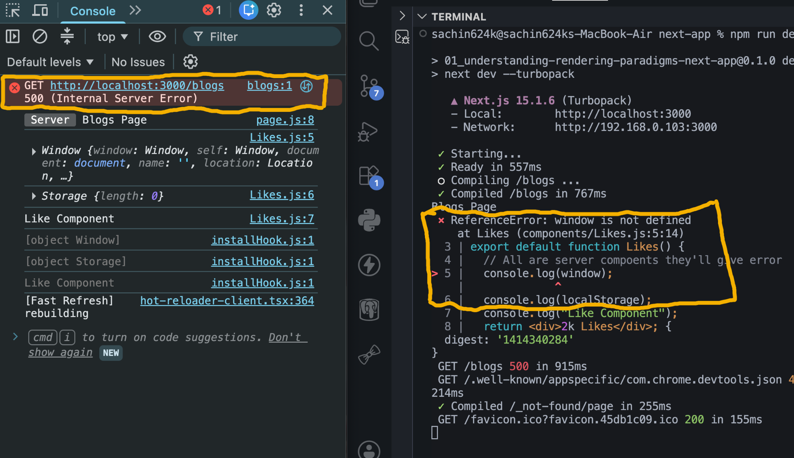
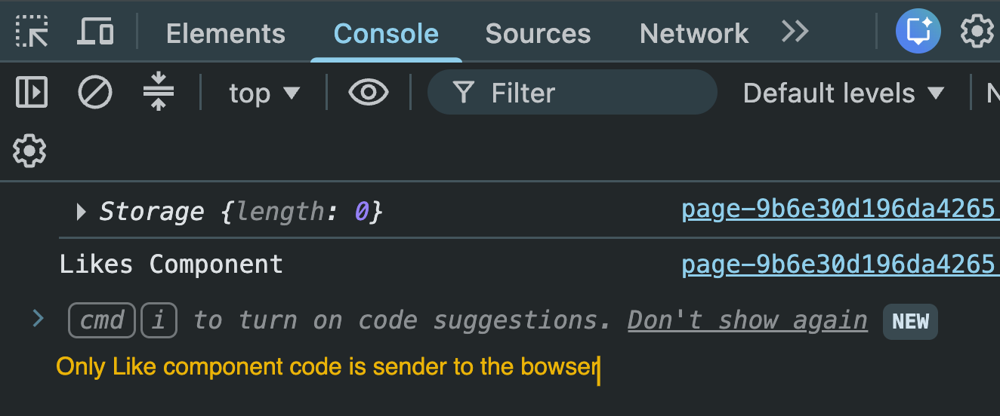
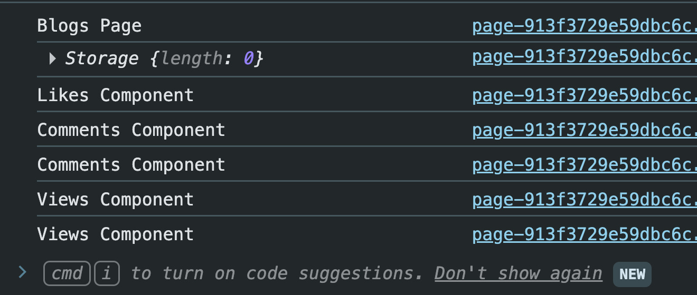

# Server Components vs Client Components in Next.js

## Introduction

By default,

every component inside the App Router is a **Server Component**.

Example

```
app/
components/
```

```
Likes.js
Comments.js
Views.js
```

All of these are Server Components unless we explicitly make them Client Components.

---

# Server Components

Server Components execute on the server.

They are never shipped as JavaScript to the browser.

Example

```jsx
export default function Likes() {
  return <div>2K Likes</div>;
}
```

This component renders on the server.

The browser only receives the generated HTML.

---

# Why Can't Server Components Use Browser APIs?

Suppose we write

```jsx
console.log(window);

console.log(localStorage);
```

inside a Server Component.

Example

```jsx
export default function Likes() {
  console.log(window);

  console.log(localStorage);

  return <div>2K Likes</div>;
}
```

This throws

```
ReferenceError

window is not defined
```

Why?

Because Server Components execute inside Node.js.

Node.js does not provide browser APIs like

- window
- document
- localStorage
- navigator

Example



---

# Converting to a Client Component

To access browser APIs,

simply add

```jsx
"use client";
```

at the top of the file.

Example

```jsx
"use client";

export default function Likes() {
  console.log(window);

  console.log(localStorage);

  return <div>2K Likes</div>;
}
```

Now the component becomes a Client Component.

---

# Accessing Browser APIs Safely

Although Client Components hydrate in the browser, they are also involved in the initial server render.

To safely access browser-only APIs, check that they exist.

Example

```jsx
if (typeof localStorage !== "undefined") {
  console.log(localStorage);
}
```

This prevents server-side errors.

Example



---

# Event Handlers

Server Components cannot contain interactive browser logic like

```jsx
<button onClick={handleClick}>
```

because event handlers require JavaScript running in the browser.

To use

```
onClick

onChange

onSubmit

useState

useEffect
```

the component must be a Client Component.

---

# What Happens After Adding "use client"?

Suppose

```
Likes.js
```

contains

```jsx
"use client";
```

Now

- HTML is still generated on the server.
- JavaScript for Likes is sent to the browser.
- React hydrates the component.
- Browser interactions become possible.

Only the JavaScript required for the Client Component is downloaded.

Server Components remain on the server.

---

# Build Output

After

```
npm run build

npm start
```

Notice that only the Client Component executes inside the browser.

Example



This is because only the Likes component was marked with

```
"use client"
```

---

# Client Boundary

Suppose we move

```jsx
"use client";
```

from

```
Likes.js
```

to

```
Blogs Page
```

Example

```jsx
"use client";

import Likes from "@/components/Likes";
import Comments from "@/components/Comments";
import Views from "@/components/Views";
```

Now

```
Blogs

├── Likes
├── Comments
└── Views
```

all become part of the client boundary.

Meaning,

their JavaScript is now included in the client bundle.

Example



---

# Why Is This Not Recommended?

Sending more JavaScript increases

- Bundle Size
- Download Time
- Hydration Time

Instead,

mark only the components that actually require browser features.

Example

```
Blogs

↓

Server Component

↓

Likes

↓

Client Component
```

This keeps the JavaScript bundle small.

---

# Best Practice

Keep pages as Server Components whenever possible.

Add `"use client"` only to components that need

- useState
- useEffect
- onClick
- Browser APIs
- localStorage
- window
- document

Avoid making an entire page a Client Component unless absolutely necessary.

---

# Server vs Client Components

| Server Component       | Client Component            |
| ---------------------- | --------------------------- |
| Default in App Router  | Requires `"use client"`     |
| Executes on the server | Hydrates in the browser     |
| No browser APIs        | Can access browser APIs     |
| Smaller bundle         | Sends JavaScript to browser |
| Better performance     | Supports interactivity      |

---

# Key Takeaways

- Every component is a Server Component by default.
- Add `"use client"` only when browser APIs or React client features are required.
- Server Components cannot access `window`, `document`, or `localStorage`.
- Client Components send JavaScript to the browser and become interactive after hydration.
- Placing `"use client"` higher in the component tree increases the client-side JavaScript bundle.
- Keep the client boundary as small as possible for the best performance.
