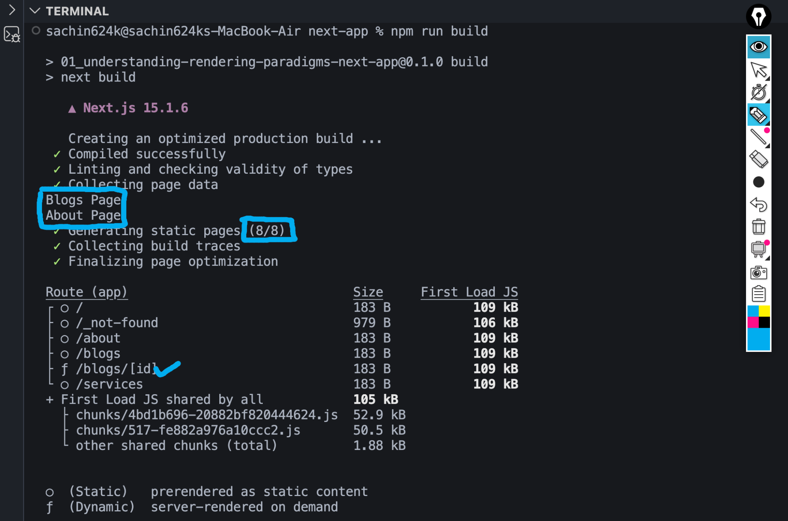
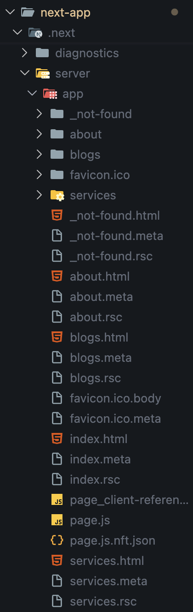
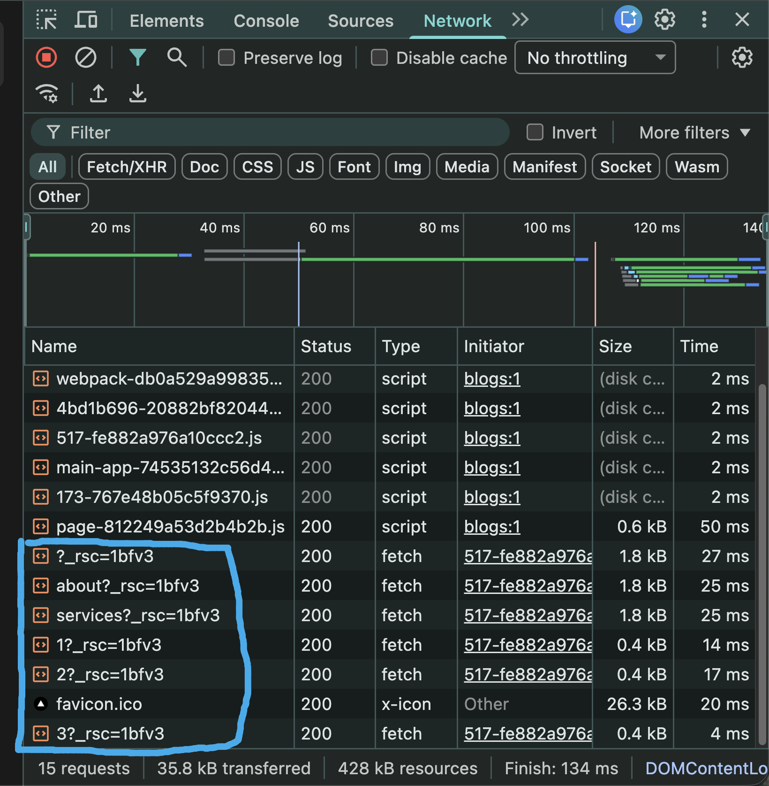

# Static Rendering vs Dynamic Rendering vs Client Side Rendering

In this project, we have the following routes:

| Route | Rendering Type |
|--------|----------------|
| `/` | Static Rendering |
| `/about` | Static Rendering |
| `/services` | Static Rendering |
| `/blogs` | Static Rendering |
| `/blogs/[id]` | Dynamic Rendering |

---

# Console.log Behavior

To understand when a page actually renders, we added `console.log()` inside the page components.

Example:

```jsx
export default function About() {
    console.log("About Page");

    return (
        <h1>About</h1>
    );
}
```

We also added console logs inside:

- About Page
- Blogs Page
- Individual Blog Page (`blogs/[id]`)

---

# Development Mode

Run

```bash
npm run dev
```

In Development Mode:

- Every page is rendered whenever required.
- Console logs will continuously appear.
- Browser navigation may trigger multiple renders.
- Hot Reload (Fast Refresh) also causes components to render again.

Therefore, even Static Pages like

- About
- Blogs
- Home

can print logs multiple times.

This behavior is **only for development** and helps developers during coding.

It **does not represent Production behavior**.

---

# Production Build

Now create a production build.

```bash
npm run build
```

During build, Next.js starts generating all static pages.

Since About and Blogs are Static Pages, they execute **only once** during build time.

You can clearly see the console logs:



As shown above:

```
Blogs Page
About Page
```

These logs appear only once because these pages are prerendered while building the application.

---

# Generated Routes

After build completes, Next.js shows something similar to:

```
Route (app)

○ /
○ /about
○ /blogs
ƒ /blogs/[id]
○ /services
```

Meaning:

| Symbol | Meaning |
|---------|----------|
| ○ | Static Page |
| ƒ | Dynamic Server Rendered Page |

Notice:

```
ƒ /blogs/[id]
```

This page is **not prerendered**.

Instead, it will render whenever a request comes to the server.

---

# .next Folder

After running

```bash
npm run build
```

Next.js creates the `.next` folder.

Inside:

```
.next/
    server/
        app/
```

You will notice files like

```
about.html
blogs.html
services.html
index.html

about.rsc
blogs.rsc
services.rsc
```

Example:



---

## Why HTML Files Exist?

These pages are Static Pages.

Next.js already generated them during Build Time.

So no rendering is required later.

Whenever a request comes,

Next.js simply serves the already generated HTML.

This makes the application extremely fast.

---

## Why blogs/[id] HTML Doesn't Exist?

Notice that

```
blogs/[id]
```

does not have an HTML file.

Why?

Because Next.js cannot know beforehand which Blog ID the user will visit.

For example

```
/blogs/1
/blogs/25
/blogs/500
/blogs/1000
```

There are unlimited possibilities.

Therefore,

Next.js waits until a request comes.

Only then does it render the page.

This is called **Dynamic Rendering**.

---

# Static Rendering Flow

```
Developer

↓

npm run build

↓

Next.js executes page once

↓

HTML Generated

↓

Stored inside .next/server/app

↓

User requests page

↓

Already generated HTML returned
```

Static Pages execute only during Build Time.

---

# Dynamic Rendering Flow

```
User requests

↓

/blogs/5

↓

Next.js Server executes page

↓

HTML Generated

↓

Response sent

↓

Next request

↓

Page executes again
```

Dynamic Pages execute on every request.

---

# Running Production

Now start the production server.

```bash
npm start
```

---

# What Happens Now?

The console logs from Static Pages will **NOT** appear anymore.

Because those pages were already rendered during build.

They simply serve the generated HTML.

Only Dynamic Pages continue executing.

For example

```
/blogs/1
```

Every request prints

```
Blog Details Page
```

because that page renders on demand.

---

# Important Observation

Suppose you run

```bash
npm run build
```

Then modify

```jsx
About Page
```

Nothing changes in Production.

Because the application is already built.

You must rebuild the application.

```bash
npm run build
npm start
```

Only then will changes become visible.

---

# Static Rendering Summary

✔ Happens during Build Time

✔ HTML generated once

✔ Extremely Fast

✔ Better SEO

✔ Lower Server Work

✔ Console.log executes during build only

---

# Dynamic Rendering Summary

✔ Happens during Request Time

✔ HTML generated for every request

✔ Fresh Data

✔ Personalized Content

✔ Higher Server Work

✔ Console.log executes on every request

---

# Both are Server Side Rendering

A common misconception is:

> Static Rendering is different from Server Side Rendering.

Actually,

Both happen on the server.

Difference is only **when** they render.

| Static Rendering | Dynamic Rendering |
|-----------------|-------------------|
| Build Time | Request Time |
| One Time | Every Request |
| HTML Cached | HTML Generated |
| Faster | Slightly Slower |

So,

Both belong to Server Side Rendering.

---

# Client Side Rendering (CSR)

After starting Production

```bash
npm start
```

Open DevTools

```
Network
```

Navigate between pages.

You will notice requests like

```
about?_rsc=...
services?_rsc=...
1?_rsc=...
2?_rsc=...
3?_rsc=...
```

Example:



These are **React Server Component (RSC) Payloads**.

---

# What is an RSC Payload?

Instead of downloading an entire HTML page every time,

Next.js sends a lightweight payload.

This payload contains only the required React component tree.

React then updates the UI without reloading the whole page.

This makes navigation much faster.

---

# Why Does Every Navigation Make Fetch Requests?

Whenever we navigate using

```jsx
<Link>
```

Next.js performs a fetch request.

Example:

```
about?_rsc=...
```

instead of

```
about.html
```

This payload is merged into the existing page.

No full page refresh occurs.

---

# Static Pages Also Use CSR

Even Static Pages perform fetch requests during navigation.

Why?

Because Next.js behaves like a Single Page Application after hydration.

The initial page is server rendered.

Later navigation becomes client-side.

This gives us:

- Faster navigation
- Better user experience
- No full page reload

---

# Dynamic Pages Also Use CSR

Even Dynamic Pages receive RSC payloads.

Example:

```
blogs/1?_rsc=...
```

The server renders fresh data,

then sends the RSC payload,

and React updates only the required UI.

---

# SSR + CSR Work Together

This is one of the biggest advantages of Next.js.

When opening a page directly:

```
Browser
↓

Server Rendering

↓

HTML Returned

↓

Hydration

↓

React Becomes Interactive
```

After hydration,

every navigation uses

```
Client Side Rendering
```

through RSC fetch requests.

So both rendering strategies work together.

---

# Rendering Lifecycle

```
User visits website

↓

Server renders page
(Static or Dynamic)

↓

Browser receives HTML

↓

React Hydrates

↓

Application becomes interactive

↓

User navigates

↓

Next.js fetches RSC Payload

↓

Only required UI updates

↓

No full page refresh
```

---

# Key Takeaways

- Static Rendering executes only during **Build Time**.
- Dynamic Rendering executes **on every request**.
- Both Static and Dynamic Rendering happen on the **server**.
- After hydration, Next.js uses **Client Side Rendering** for navigation.
- Navigation fetches **RSC Payloads**, not full HTML pages.
- Static pages are served instantly because HTML already exists.
- Dynamic pages generate HTML only when requested.
- If you change code after `npm run build`, you must rebuild to see those changes in production.