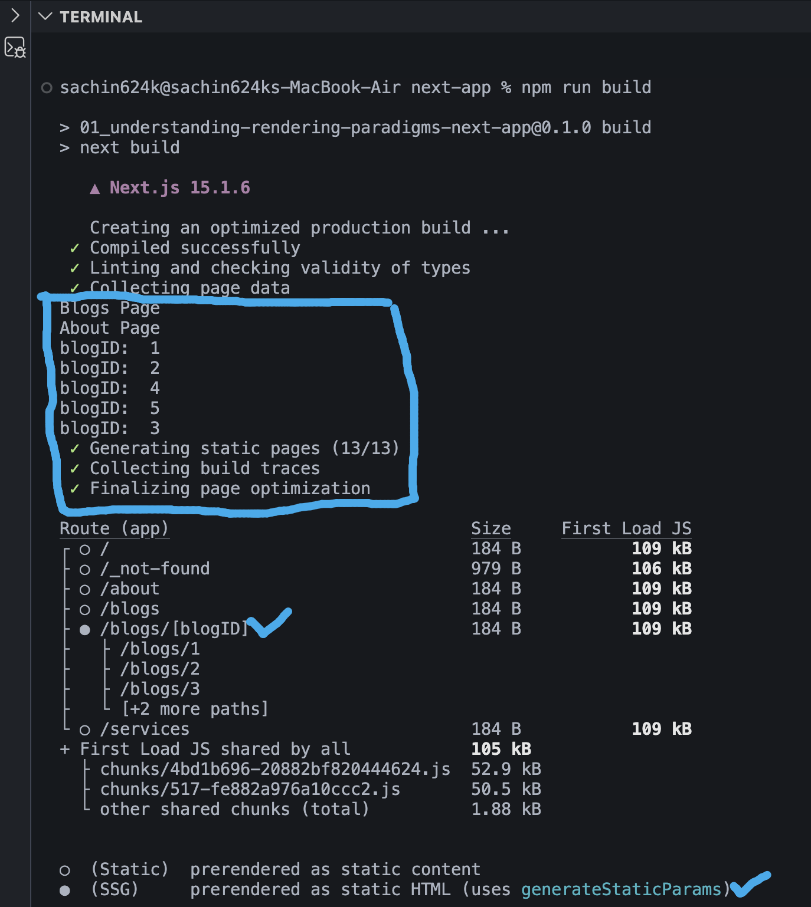
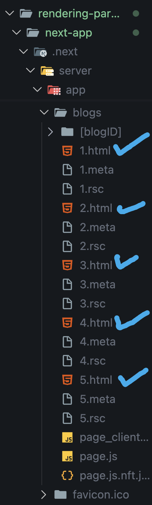
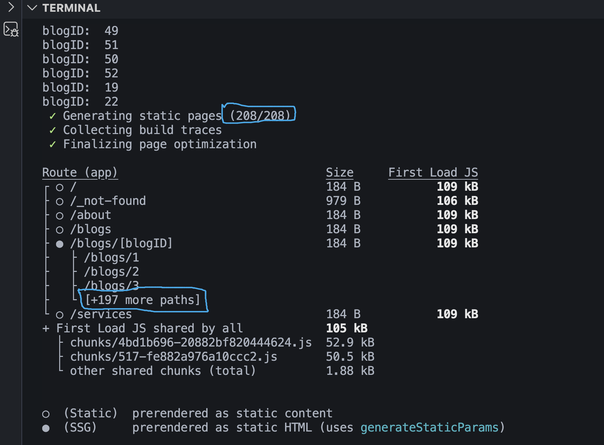
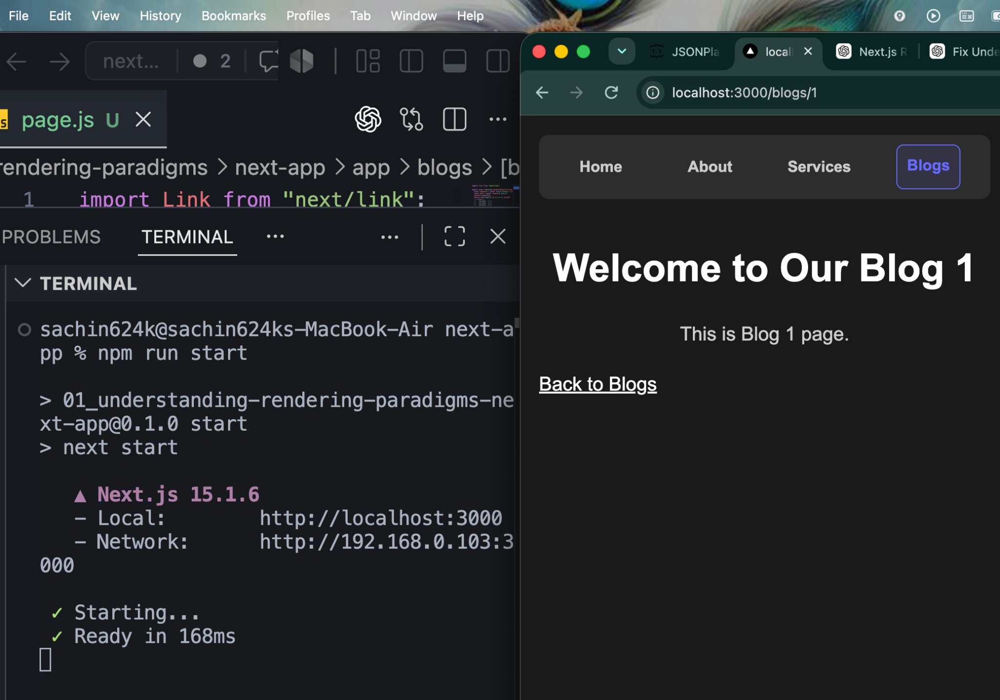
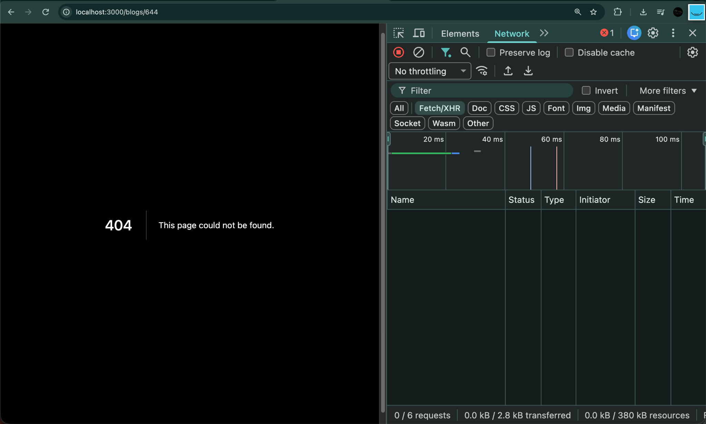

# Static Site Generation (SSG) in Next.js

## What is Static Site Generation (SSG)?

Static Site Generation (SSG) is a rendering strategy where HTML is generated **during the build process** instead of when a user requests the page.

In Next.js, SSG is still a part of **Server Side Rendering**, but instead of rendering on every request, pages are rendered only once during build time.

```
Build Time
      │
      ▼
Generate HTML
      │
      ▼
Store inside .next
      │
      ▼
Serve HTML to every visitor
```

---

# Why Do We Need SSG?

Imagine we have a dynamic route.

```
app
└── blogs
      └── [blogID]
             └── page.js
```

Normally,

```
/blogs/1
/blogs/2
/blogs/3
```

are generated only when someone visits them.

This is Dynamic Rendering.

---

# Problem

Suppose

```
Blog 1
Blog 2
Blog 3
Blog 4
Blog 5
```

are visited thousands of times every day.

Rendering them again and again wastes server resources.

Instead,

we can generate these pages once while building the application.

This is exactly what Static Site Generation does.

---

# generateStaticParams()

Next.js provides

```js
generateStaticParams();
```

to tell Next.js

> "These dynamic routes are already known.
> Generate them during build."

Example

```jsx
export function generateStaticParams() {
  return [
    { blogID: "1" },
    { blogID: "2" },
    { blogID: "3" },
    { blogID: "4" },
    { blogID: "5" },
  ];
}
```

---

# What Happens During Build?

Run

```bash
npm run build
```

Next.js executes

```
generateStaticParams()
```

Then builds

```
/blogs/1
/blogs/2
/blogs/3
/blogs/4
/blogs/5
```

before deployment.

Notice the build output.



The build now shows

```
● /blogs/[blogID]
```

instead of

```
ƒ /blogs/[blogID]
```

because those paths are prerendered using SSG.

---

# Console Logs During Build

Inside

```jsx
page.js;
```

we added

```jsx
console.log("blogID:", params.blogID);
```

During

```bash
npm run build
```

Next.js executes the page once for every generated path.

Output

```
blogID: 1
blogID: 2
blogID: 3
blogID: 4
blogID: 5
```

Exactly what we expected.

---

# Generated Files

Open

```
.next/server/app/blogs
```

You'll notice

```
1.html
2.html
3.html
4.html
5.html

1.rsc
2.rsc
3.rsc
4.rsc
5.rsc
```

Example



These pages already exist before any user visits them.

---

# What Does ● Mean?

During build,

Next.js displays

```
● /blogs/[blogID]
```

Meaning

```
SSG
```

Static HTML generated using

```
generateStaticParams()
```

This is different from

```
ƒ
```

which means

```
Dynamic Rendering
```

---

# Static Generation from an API

Instead of manually returning IDs,

we can fetch them from an API.

Example

```jsx
export async function generateStaticParams() {
  const response = await fetch("https://jsonplaceholder.typicode.com/todos");

  const data = await response.json();

  return data.map(({ id }) => ({
    blogID: `${id}`,
  }));
}
```

During build,

Next.js first fetches all todos,

then generates every corresponding blog page.

---

# Build Output

Notice the output.



```
Generating static pages (208/208)
```

The terminal also shows

```
blogID: 1
blogID: 2
...
blogID: 200
```

Meaning

Next.js generated all 200 pages during build.

---

# Production

Run

```bash
npm start
```

Open

```
/blogs/1
```

Nothing appears in the terminal.

Why?

Because

```
blogs/1
```

already exists as HTML.

The server simply returns the file.

No rendering happens.

Example



---

# What About /blogs/205?

Suppose only

```
1 - 200
```

were generated.

Now visit

```
/blogs/205
```

This page does not exist.

Next.js must render it dynamically.

Therefore

```
console.log()
```

appears again.

This proves

```
[blogID]
```

is still a dynamic route,

but only some paths were statically generated.

---

# Dynamic Route vs Static Pages

```
Dynamic Route

blogs/[blogID]
```

↓

```
generateStaticParams()
```

↓

```
Static HTML

/blogs/1
/blogs/2
/blogs/3
/blogs/4
/blogs/5
```

The route stays dynamic,

but selected paths become static.

---

# Advantages of SSG

- Extremely Fast
- Better SEO
- Lower Server Load
- Pages served instantly
- Great for blogs
- Great for documentation
- Great for marketing websites

---

# Limitation of SSG

Suppose Blog 1 displays data from an API.

```
Blog Title
Views
Likes
Comments
```

If these values change every minute,

SSG becomes outdated.

Because HTML was generated during build.

The page won't update until

```
npm run build
```

is executed again.

This is where **Incremental Static Regeneration (ISR)** becomes useful.

ISR allows static pages to be regenerated automatically after a specified interval without rebuilding the entire application.

We'll learn ISR in the next chapter.

---

# dynamicParams

By default,

```jsx
export const dynamicParams = true;
```

This means if a user visits a page that was **not generated** by `generateStaticParams()`, Next.js will **render it dynamically on demand**.

For example, suppose only these pages were generated during build:

```
/blogs/1
...
/blogs/200
```

Now if the user visits

```
/blogs/205
```

Next.js will render that page dynamically because `dynamicParams` is `true` by default.

---

# Disabling Dynamic Generation

If you don't want Next.js to generate new pages after the build, set

```jsx
export const dynamicParams = false;
```

Then rebuild your application.

```bash
npm run build
npm start
```

Now only the pages returned by `generateStaticParams()` are available.

If the user visits

```
/blogs/205
```

Next.js immediately returns a **404 Not Found** page instead of rendering it dynamically.

Example:



---

# Summary

| `dynamicParams = true` (Default)         | `dynamicParams = false`   |
| ---------------------------------------- | ------------------------- |
| Unknown routes are rendered dynamically  | Unknown routes return 404 |
| More flexible                            | More restrictive          |
| Suitable for frequently changing content | Suitable for fixed routes |

---

# Complete Flow

```
Developer

↓

generateStaticParams()

↓

npm run build

↓

Next.js fetches IDs

↓

Generates HTML

↓

Stores inside .next

↓

Deploy

↓

User visits page

↓

Already generated HTML returned

↓

No rendering required
```

---

# Key Takeaways

- SSG generates HTML during build time.
- `generateStaticParams()` tells Next.js which dynamic paths should be prerendered.
- The route remains dynamic (`[blogID]`), but specified paths become static.
- Generated pages are stored inside the `.next` directory as HTML and RSC files.
- These pages are served instantly without server-side rendering on every request.
- If the underlying data changes frequently, SSG alone is not sufficient. ISR is the preferred solution.
