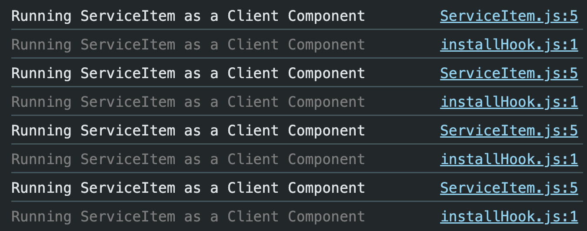
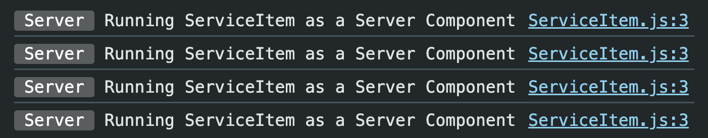
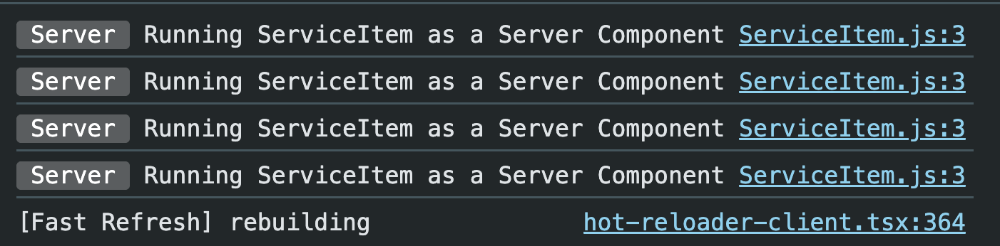

# Rendering Server Components Inside Client Components

## Problem

Suppose we have:

- `page.js` → Server Component
- `ServiceList.js` → Client Component
- `ServiceItem.js` → Server Component

```jsx
"use client";

import ServiceItem from "./ServiceItem";

export default function ServiceList() {
  return <ServiceItem />;
}
```

Although `ServiceItem` doesn't have `"use client"`, it still runs as a **Client Component**.

### Why?

Because it is **imported inside a Client Component**.

```
Client Component
      │
 imports
      ▼
Server Component

↓

Becomes part of the Client Bundle
```

### Output



---

## Removing `"use client"`

If we remove `"use client"` from `ServiceList.js`, then both components become **Server Components**.

```
page.js (Server)
      │
      ▼
ServiceList (Server)
      │
      ▼
ServiceItem (Server)
```

### Output



---

# How to Keep ServiceItem as a Server Component?

Instead of importing `ServiceItem` inside `ServiceList`, render it in `page.js` and pass it as `children`.

## page.js

```jsx
<ServiceList>
  {services.map((service) => (
    <ServiceItem key={service} serviceName={service} />
  ))}
</ServiceList>
```

---

## ServiceList.js

```jsx
"use client";

export default function ServiceList({ children }) {
  return (
    <>
      <h3>All Services List</h3>
      <ul>{children}</ul>
    </>
  );
}
```

---

## How Does This Work?

Everything written between

```jsx
<ServiceList>...</ServiceList>
```

becomes

```jsx
children;
```

So React internally does something like

```jsx
<ServiceList
  children={services.map((service) => (
    <ServiceItem key={service} serviceName={service} />
  ))}
/>
```

Notice:

`ServiceList` **does not import** `ServiceItem`.

It only receives already-created JSX.

---

## Rendering Flow

```
page.js (Server)

↓

Creates

<ServiceItem />

↓

ServiceItem renders on Server

↓

Passed as children

↓

ServiceList (Client)

↓

Displays children
```

So,

`ServiceItem` never becomes a Client Component.

---

### Output



---

# Import vs Children

| Import                          | Children                 |
| ------------------------------- | ------------------------ |
| Client imports Server Component | Server passes JSX        |
| Becomes Client Component        | Remains Server Component |
| More JavaScript                 | Less JavaScript          |
| Avoid                           | Recommended              |

---

# Key Takeaways

- Importing a Server Component into a Client Component makes it part of the client bundle.
- Passing a Server Component as `children` keeps it a Server Component.
- `children` is just a React prop containing JSX.
- The Client Component only displays the received UI; it does not execute the Server Component.
- This pattern reduces JavaScript sent to the browser and is the recommended approach in Next.js.
