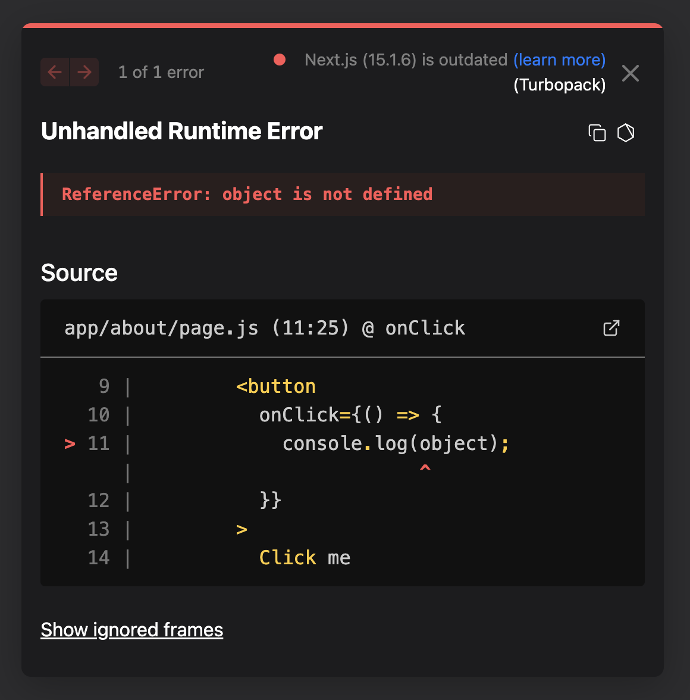
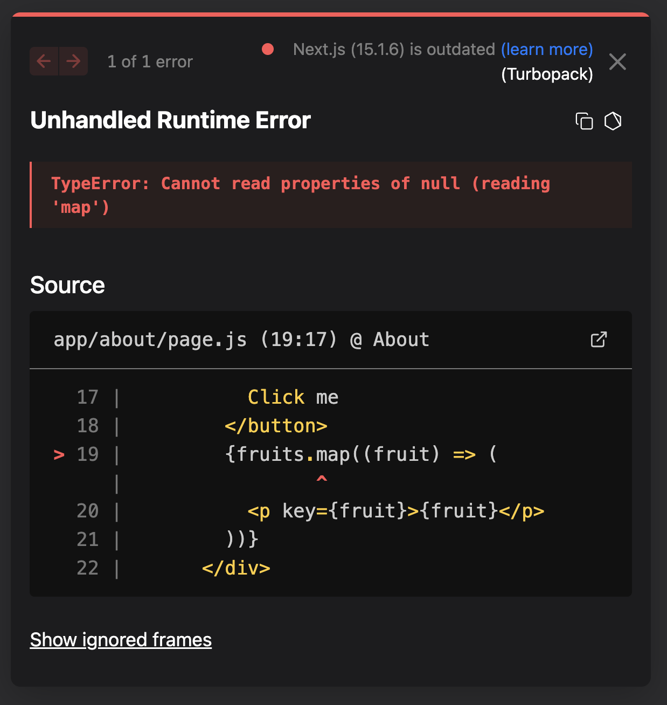
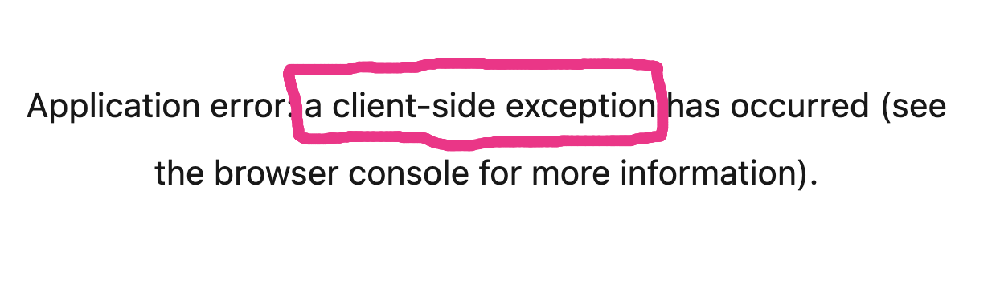
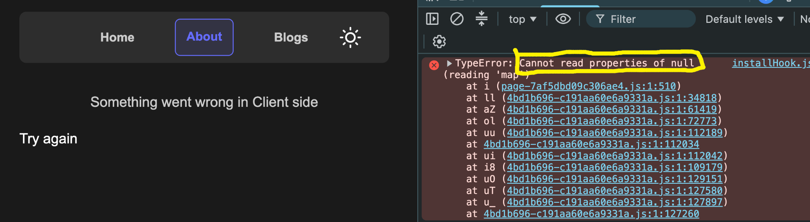

# Handling Client-Side Exceptions in Next.js

In the previous chapters, we learned how to handle **Server Component errors** using `error.js`.

Now let's understand **Client-Side Exceptions** and how to handle them.

---

# Server-Side vs Client-Side Exceptions

There are two kinds of exceptions in Next.js.

## 1. Server-Side Exception

Occurs while rendering a **Server Component**.

Example

```jsx
throw new Error("Error occurred");
```

Production page:


Notice

```
Application error:
a server-side exception has occurred
```

Server-side exceptions also contain a **digest** property that can be matched with the server logs.

---

## 2. Client-Side Exception

Occurs inside a **Client Component**.

Unlike server errors, client-side exceptions happen **inside the browser**.

---

# Normal Client Errors

Suppose we write

```jsx
"use client";

<button
  onClick={() => {
    console.log(object);
  }}
>
  Click me
</button>;
```

Clicking the button throws

```
ReferenceError:
object is not defined
```

### Development Mode



This error appears in the browser console (and the development overlay), but the application **continues running** because the error happens inside an event handler.

> **Important:** Errors thrown inside event handlers (like `onClick`) are **not rendering errors**, so React Error Boundaries do **not** catch them.

---

# Rendering Errors

Now create a rendering error.

```jsx
"use client";

import { useState } from "react";

export default function About() {
  const [fruits, setFruits] = useState(["Mango", "Apple"]);

  return (
    <>
      <button
        onClick={() => {
          setFruits(null);
        }}
      >
        Click me
      </button>

      {fruits.map((fruit) => (
        <p key={fruit}>{fruit}</p>
      ))}
    </>
  );
}
```

Initially

```
fruits

↓

["Mango", "Apple"]
```

After clicking

```
fruits

↓

null
```

Now React tries to execute

```jsx
fruits.map(...)
```

which causes

```
Cannot read properties of null
```

---

# Development Mode

A rendering error shows the React error overlay.



Unlike a normal console error,

this error crashes the current React tree.

---

# Production Mode

Build the application.

```bash
npm run build
npm run start
```

Now the page displays

```
Application error:
a client-side exception has occurred
```

instead of the development overlay.



Unlike server errors,

the detailed error information is available in the **browser console** because the error occurred on the client.

---

# Handling Client-Side Exceptions

Create

```
app/about/error.js
```

```jsx
"use client";

export default function Error({ reset }) {
  return (
    <div>
      <p>Something went wrong in Client Side</p>

      <button
        onClick={() => {
          reset();
        }}
      >
        Try Again
      </button>
    </div>
  );
}
```

> **Important:** `error.js` must always be a **Client Component**, so it requires `"use client"`.

---

# Result

Now instead of crashing the application,

Next.js renders our custom error UI.



The rest of the application continues to work normally.

---

# What Does `reset()` Do?

```jsx
reset();
```

tells the Error Boundary

```
Try rendering this route again.
```

If the error was temporary,

the page renders successfully.

Otherwise,

the Error Boundary appears again.

---

# Server vs Client Error Boundaries

The same

```
error.js
```

can handle

- Server Component rendering errors
- Client Component rendering errors

as long as those errors occur **within the route segment protected by that Error Boundary**.

However, it **cannot** catch:

- Errors inside event handlers (`onClick`, `onSubmit`, etc.)
- Errors in asynchronous callbacks like `setTimeout`
- Errors outside the React rendering tree

Those should be handled with normal JavaScript `try...catch` or other error-handling techniques.

---

# Normal Error vs Rendering Error

| Normal Error                  | Rendering Error                          |
| ----------------------------- | ---------------------------------------- |
| Happens inside event handlers | Happens while rendering JSX              |
| Application continues running | React tree crashes                       |
| Appears in browser console    | Shows React error overlay in development |
| Not caught by `error.js`      | Caught by `error.js`                     |

---

# Server Exception vs Client Exception

| Server Exception                                        | Client Exception                                                                         |
| ------------------------------------------------------- | ---------------------------------------------------------------------------------------- |
| Happens during server rendering                         | Happens during client rendering                                                          |
| Browser shows generic production error with a Digest ID | Browser shows generic production error and detailed information is available in DevTools |
| Actual error is logged on the server                    | Actual error is available in the browser console                                         |
| Has a `digest` property                                 | No digest is provided for client rendering errors                                        |

---

# Key Takeaways

- Client-side exceptions occur inside Client Components.
- Errors thrown inside event handlers are **not** rendering errors and are **not** handled by `error.js`.
- Rendering errors occur while React is rendering JSX and can crash the React tree.
- In development, React shows an error overlay for rendering errors.
- In production, Next.js displays a generic client-side exception page.
- Creating `error.js` lets you display a custom fallback UI for rendering errors.
- Calling `reset()` tells the Error Boundary to retry rendering the route.
- The same `error.js` can handle both Server Component rendering errors and Client Component rendering errors for its route segment.
