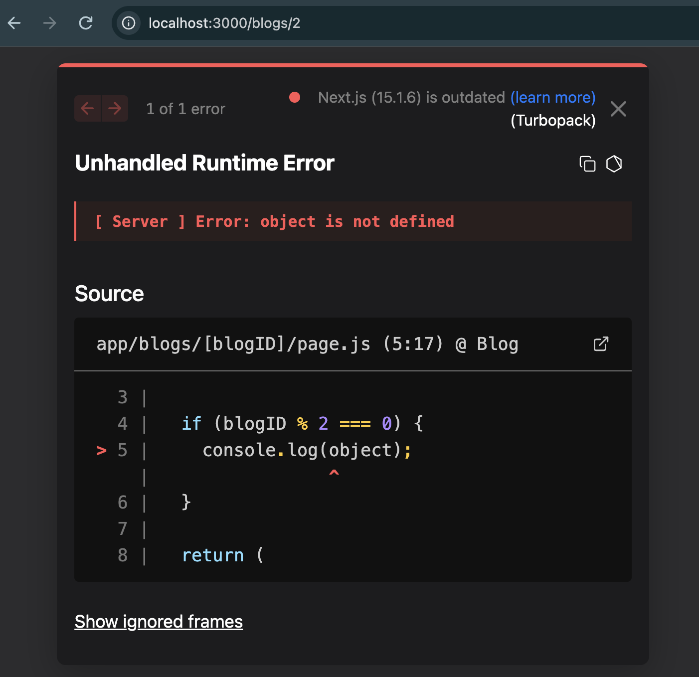
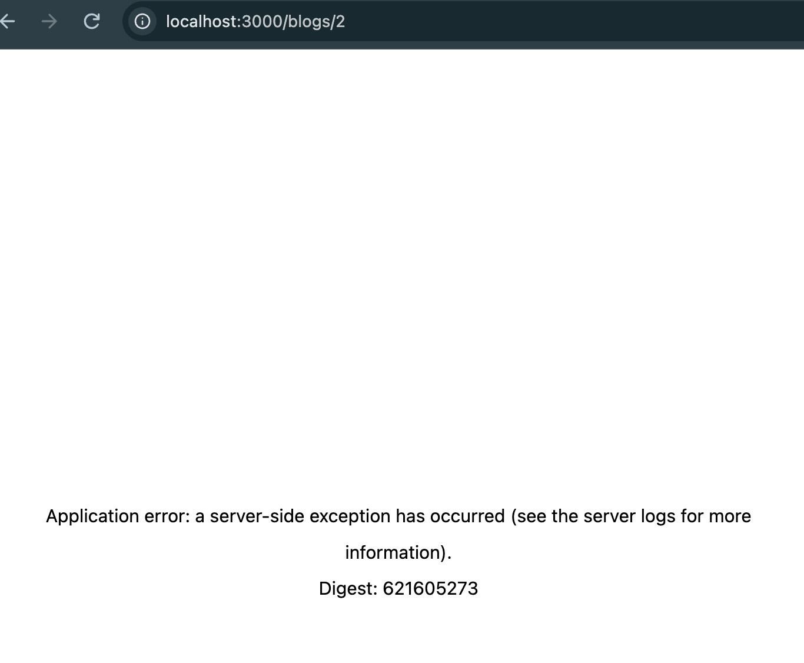
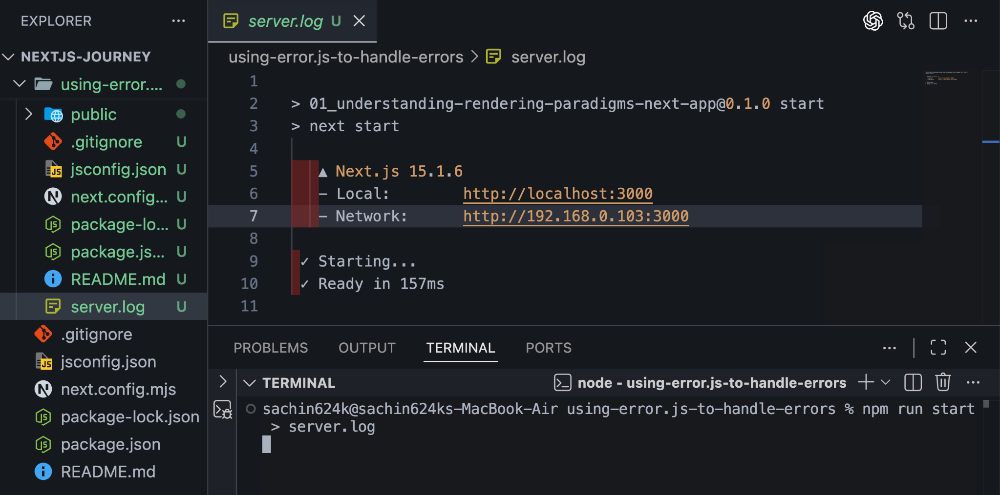
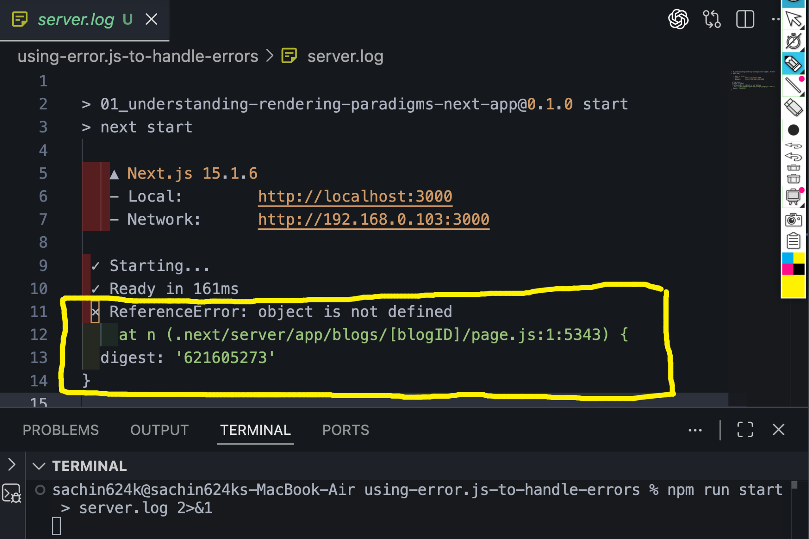
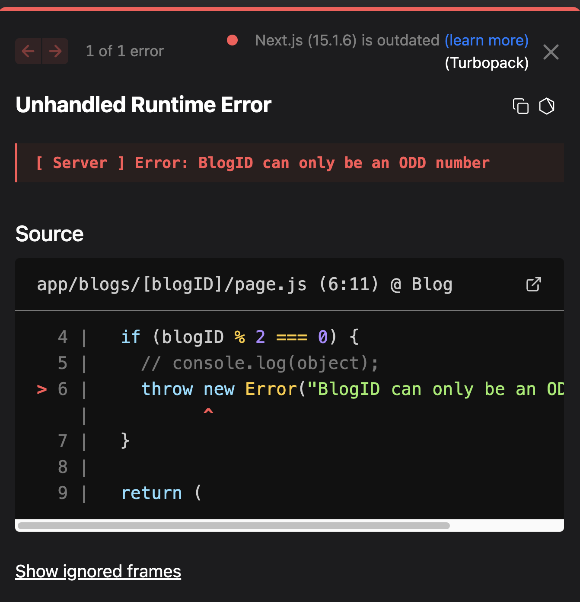
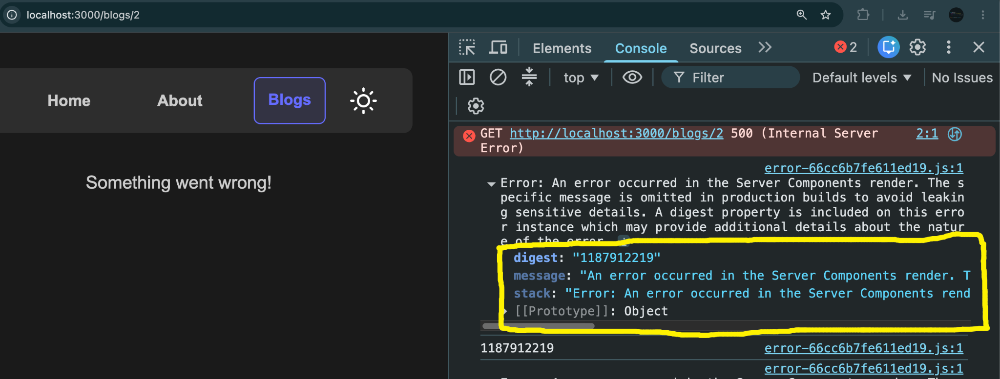
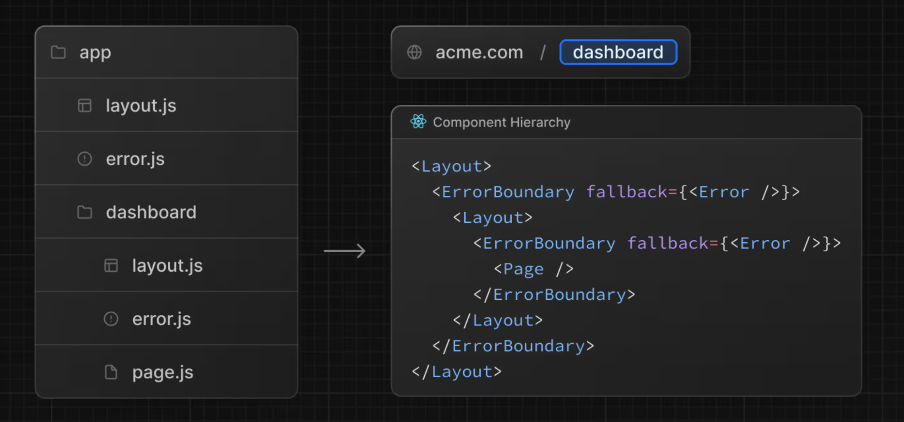

# Error Handling in Server Components

Next.js provides a built-in way to handle errors in **Server Components** using a special file called `error.js`.

This allows us to show a custom error UI instead of the default error page.

---

# Throwing an Error

Suppose we intentionally throw an error inside a Server Component.

```jsx
const Blog = async ({ params }) => {
  const { blogID } = await params;

  if (blogID % 2 === 0) {
    console.log(object);
  }

  return (
    <>
      <h1>Welcome to Our Blog {blogID}</h1>
    </>
  );
};

export default Blog;
```

If we visit

```
/blogs/2
```

the page crashes because

```
object is not defined
```

---

## Development Mode

Run

```bash
npm run dev
```

In development mode, Next.js shows the **actual error message** along with the exact line where the error occurred.



---

## Production Mode

Now build and start the application.

```bash
npm run build
npm run start
```

In production, Next.js **hides the real error message**.

Instead, it shows a generic error page with a **Digest ID**.



This is done for security reasons so internal server details are not exposed to users.

---

# Where is the Actual Error?

The real error is only available on the **server**.

For example,

```
ReferenceError: object is not defined
```

will appear inside the terminal.

The **Digest ID** shown in the browser matches the one printed in the server logs.

---

# Saving Server Logs

Instead of viewing errors only in the terminal, we can save them into a log file.

### Only Standard Output

```bash
npm run start > server.log
```

This stores only the normal console output.



---

### Store Errors as Well

```bash
npm run start > server.log 2>&1
```

Now both

- Standard Output
- Error Output

are stored in

```
server.log
```



---

### Append Logs

Instead of replacing the file every time,

append new logs.

```bash
npm run start >> server.log 2>&1
```

---

# Creating error.js

Create

```
app/blogs/[blogID]/error.js
```

```jsx
"use client";

export default function Error({ error }) {
  console.dir(error);

  console.log(error.digest);

  return (
    <div>
      <p>Something went wrong!</p>
    </div>
  );
}
```

> **Important:** `error.js` must be a **Client Component**, so it requires `"use client"`.

---

# Production Result

Now, instead of the default error page,

our custom UI is shown.



---

# Accessing the Error Object

Inside

```jsx
error.js;
```

we receive an

```jsx
error;
```

object.

```jsx
console.dir(error);
```

In production,

the actual error message is hidden,

but we can still access

```jsx
error.digest;
```

which matches the server log.

Open the browser console.



---

# How Does error.js Work?

Whenever an `error.js` file exists beside a route,

Next.js automatically wraps that route with an **Error Boundary**.

For example,

```
app
└── blogs
    └── [blogID]
        ├── page.js
        └── error.js
```

Internally it behaves like

```
Layout

↓

ErrorBoundary

↓

Page
```

If `page.js` throws an error,

the Error Boundary catches it

and renders

```
error.js
```

instead of crashing the entire application.



---

# Random Errors

Errors don't always happen every time.

Example

```jsx
const randomNumber = Math.random();

if (randomNumber > 0.5) {
  throw new Error("Error occurred");
}
```

Sometimes

```
Math.random()

↓

0.72

↓

Error
```

Sometimes

```
Math.random()

↓

0.31

↓

Page renders successfully
```

Currently, the only way to retry is by refreshing the page.

In the next chapter, we'll learn how to retry failed renders without manually refreshing the page.

---

# Development vs Production

| Development                  | Production                |
| ---------------------------- | ------------------------- |
| Shows complete error message | Hides actual error        |
| Shows source code            | Shows generic message     |
| Useful for debugging         | Safer for users           |
| Stack trace visible          | Only Digest ID is exposed |

---

# Logging Commands

```bash
# Save standard output
npm run start > server.log

# Save standard output + errors
npm run start > server.log 2>&1

# Append logs instead of replacing
npm run start >> server.log 2>&1
```

---

# Key Takeaways

- Server Component errors are shown differently in development and production.
- Development mode displays the full error message and stack trace.
- Production hides sensitive error details and displays only a Digest ID.
- The actual error is available in the server logs.
- Use `npm run start > server.log 2>&1` to save both output and errors.
- Creating an `error.js` file automatically adds an Error Boundary for that route.
- `error.js` must be a Client Component.
- The `error` object contains a `digest` property that can be matched with server logs.
- In the next chapter, we'll learn how to recover from temporary errors without manually refreshing the page.
