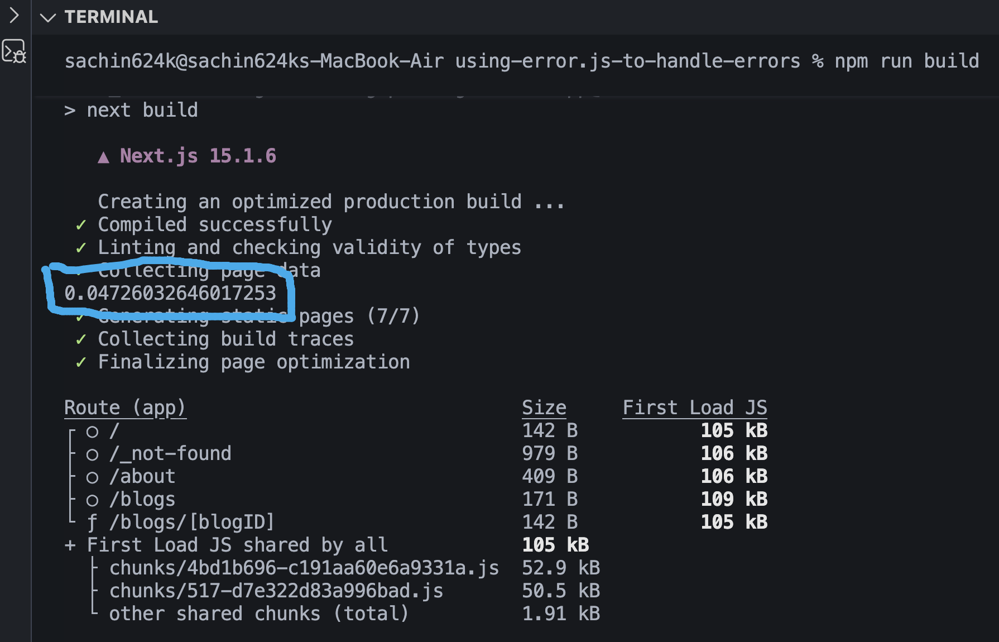
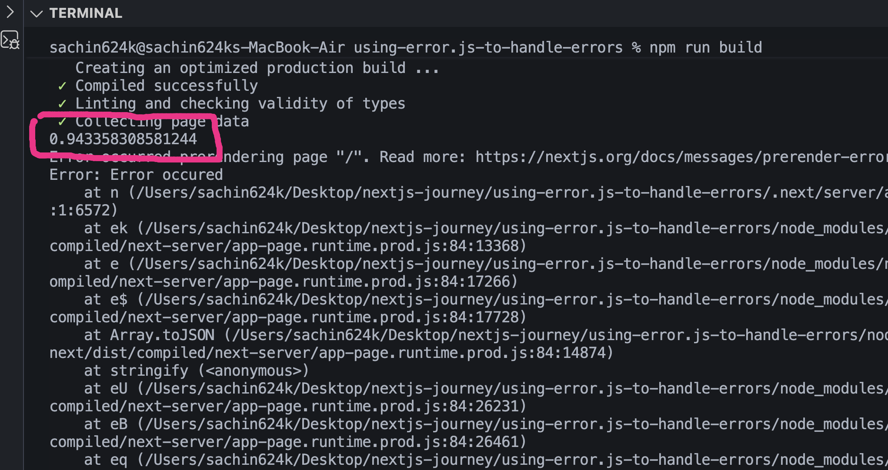
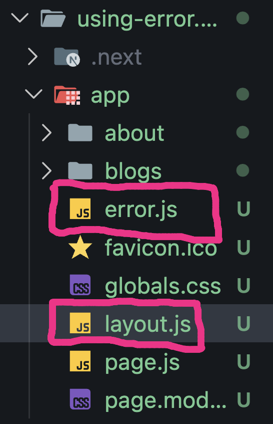
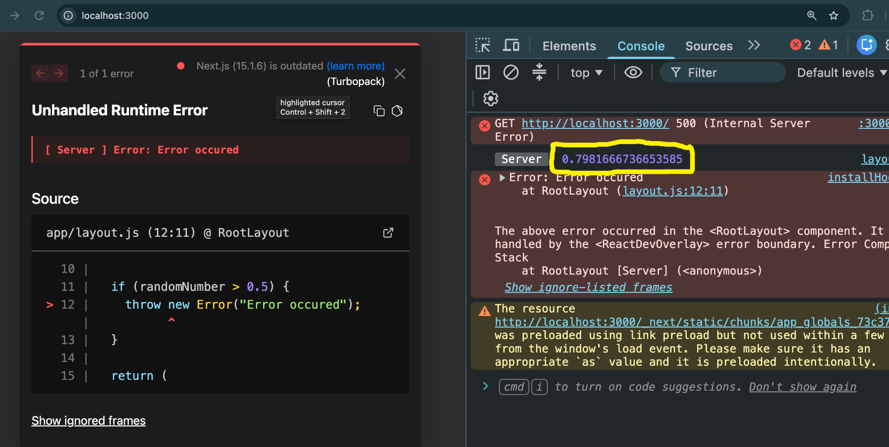
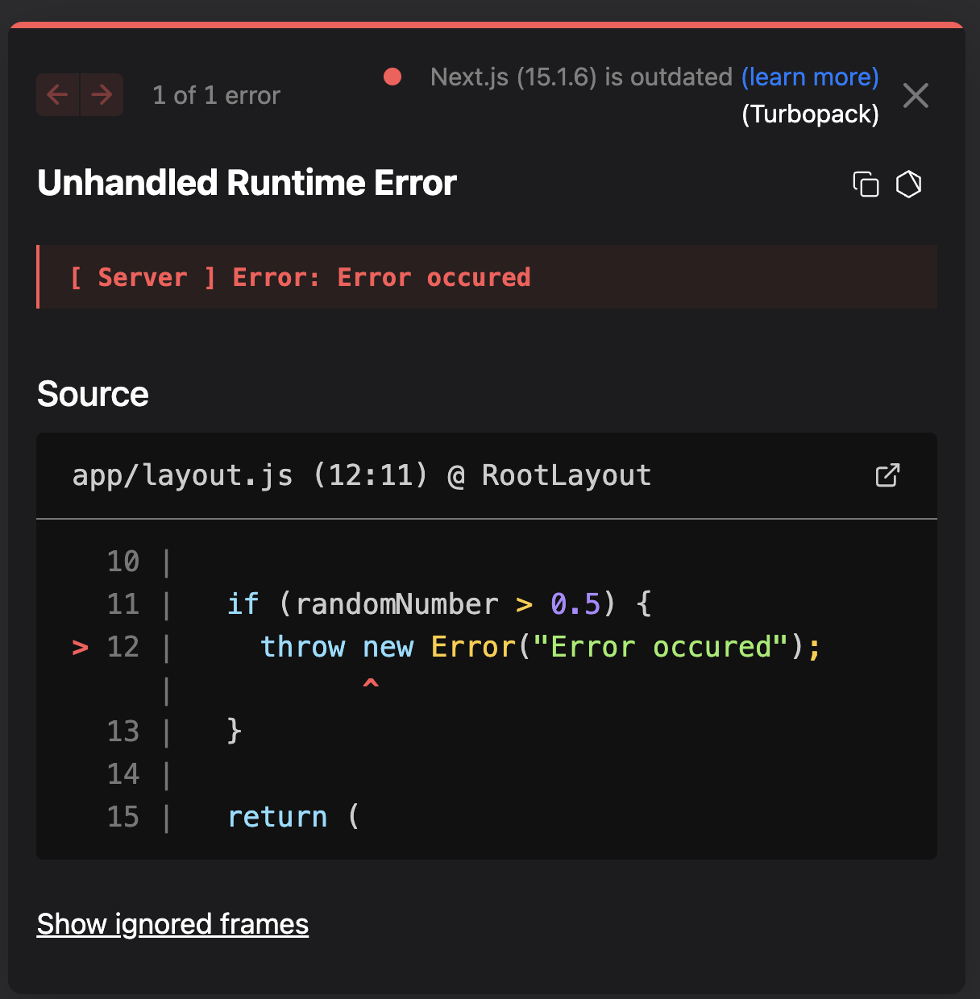
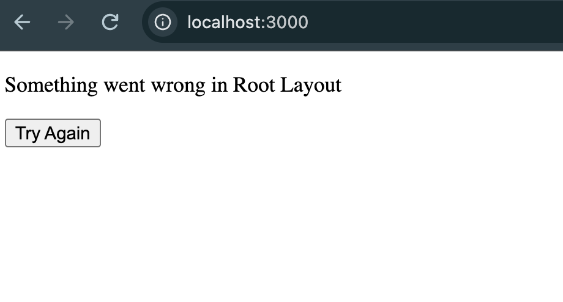

# Global Error Handling in Next.js

In the previous chapters, we learned how `error.js` handles errors for a specific route segment.

But what happens if the **Root Layout (`app/layout.js`)** itself throws an error?

For that, Next.js provides a special file called **`global-error.js`**.

---

# Route-Level Error Handling

Suppose we create

```
app/error.js
```

```jsx
"use client";

export default function Error({ error, reset }) {
  return (
    <div>
      <p>Something went wrong in Home Page</p>

      <button onClick={() => reset()}>Try Again</button>
    </div>
  );
}
```

This Error Boundary can handle errors from

- `app/page.js`
- Nested routes
- Child layouts
- Child pages

but **it cannot handle errors from `app/layout.js`**.

Why?

Because the Root Layout is **outside** its Error Boundary.

---

# Error in Home Page

For learning, we intentionally throw an error.

```jsx
export const dynamic = "force-dynamic";

export default function Home() {
  const randomNumber = Math.random();

  if (randomNumber > 0.5) {
    throw new Error("Error occurred");
  }

  return <h1>Home Page</h1>;
}
```

We use

```jsx
export const dynamic = "force-dynamic";
```

only for demonstration.

Normally,

the Home page is statically generated.

If the build succeeds once,

the same HTML is reused,

so the random error won't occur again until a new build.

Making the page dynamic forces it to render on every request.

---

# Build-Time vs Runtime

During

```bash
npm run build
```

the random number is evaluated once.

Sometimes the build succeeds.



Sometimes the build fails.



This happens because the page is statically rendered during the build.

---

# Runtime Error

Once the page is rendered dynamically,

the error can occur at runtime.

The route-level

```
app/error.js
```

handles it successfully.

---

# Error Inside Root Layout

Now move the same logic into

```
app/layout.js
```

```jsx
export const dynamic = "force-dynamic";

export default function RootLayout({ children }) {
  const randomNumber = Math.random();

  if (randomNumber > 0.5) {
    throw new Error("Error occurred");
  }

  return (
    <html>
      <body>{children}</body>
    </html>
  );
}
```

Now the error occurs inside the **Root Layout**.

---

## Folder Structure

Notice that both files are placed inside the **app** directory.

```js
app
├── layout.js
├── error.js
└── page.js
```



Since both `layout.js` and `error.js` are siblings, the Root Layout renders before the route-level Error Boundary is created.

That's why `app/error.js` **cannot** catch errors thrown by `app/layout.js`.

---

# Why Doesn't app/error.js Work?

Folder structure

```
app
├── error.js
├── layout.js
└── page.js
```

Both files are siblings.

```
layout.js

error.js
```

The Root Layout renders **before** `error.js`.

Therefore,

`error.js`

cannot catch errors thrown by

```
layout.js
```

Development Mode



---

# Global Error Handling

To handle Root Layout errors,

create

```
app/global-error.js
```

```jsx
"use client";

import "./globals.css";

export default function GlobalError() {
  return (
    <html lang="en">
      <body>
        <p>Something went wrong in Root Layout</p>

        <button
          onClick={() => {
            window.location.reload();
          }}
        >
          Try Again
        </button>
      </body>
    </html>
  );
}
```

---

# Why html and body?

Unlike

```
error.js
```

the

```
global-error.js
```

replaces the **entire Root Layout**.

Since

```
layout.js
```

normally renders

```jsx
<html>
<body>
```

our

```
global-error.js
```

must also render them.

Without these tags,

the application cannot render correctly.

---

# Development vs Production

One important difference is

```
global-error.js
```

does **not** replace the React development error overlay.

During

```bash
npm run dev
```

you'll still see the development error screen.



This is expected behavior.

---

# Production Mode

Build and start the application.

```bash
npm run build

npm run start
```

Now,

instead of crashing,

Next.js renders our

```
global-error.js
```

UI.



---

# Why Use window.location.reload()?

Unlike route-level

```
error.js
```

which can use

```jsx
reset();
```

`global-error.js` replaces the entire application.

The simplest recovery is

```jsx
window.location.reload();
```

which reloads the application from scratch.

---

# Error Hierarchy

```
Global Error

↓

Root Layout

↓

Route Error

↓

Nested Layout

↓

Page
```

Think of it as

```
global-error.js

↓

layout.js

↓

error.js

↓

page.js
```

The higher an Error Boundary is,

the more of the application it can protect.

---

# error.js vs global-error.js

| error.js                            | global-error.js                   |
| ----------------------------------- | --------------------------------- |
| Handles route segment errors        | Handles Root Layout errors        |
| Doesn't replace Root Layout         | Replaces the entire application   |
| Uses `reset()`                      | Usually reloads the page          |
| Doesn't render `<html>` or `<body>` | Must render `<html>` and `<body>` |
| Works in development and production | Mainly visible in production      |

---

# Best Practices

- Use `error.js` for normal route-level error handling.
- Use `global-error.js` only for Root Layout failures.
- Keep `global-error.js` lightweight.
- Include `<html>` and `<body>` because the Root Layout is no longer rendered.
- Don't place unnecessary components or heavy logic inside `global-error.js`.

---

# Key Takeaways

- `app/error.js` cannot catch errors thrown by `app/layout.js`.
- `global-error.js` is the highest-level Error Boundary in a Next.js application.
- `global-error.js` replaces the entire Root Layout when it fails.
- It must be a Client Component (`"use client"`).
- It must include `<html>` and `<body>` tags.
- `global-error.js` is primarily intended for production; in development, you'll still see the React/Next.js error overlay.
- Use `error.js` for route-level errors and `global-error.js` only when the Root Layout itself can fail.
