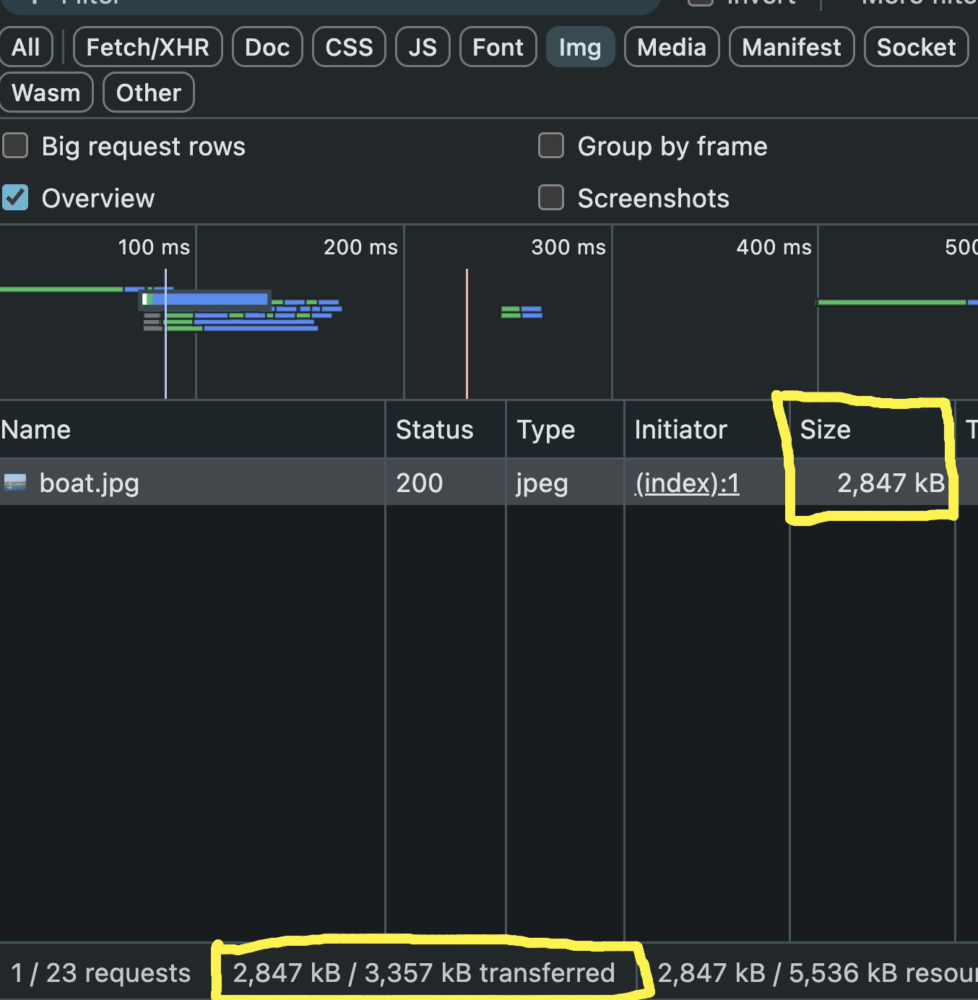
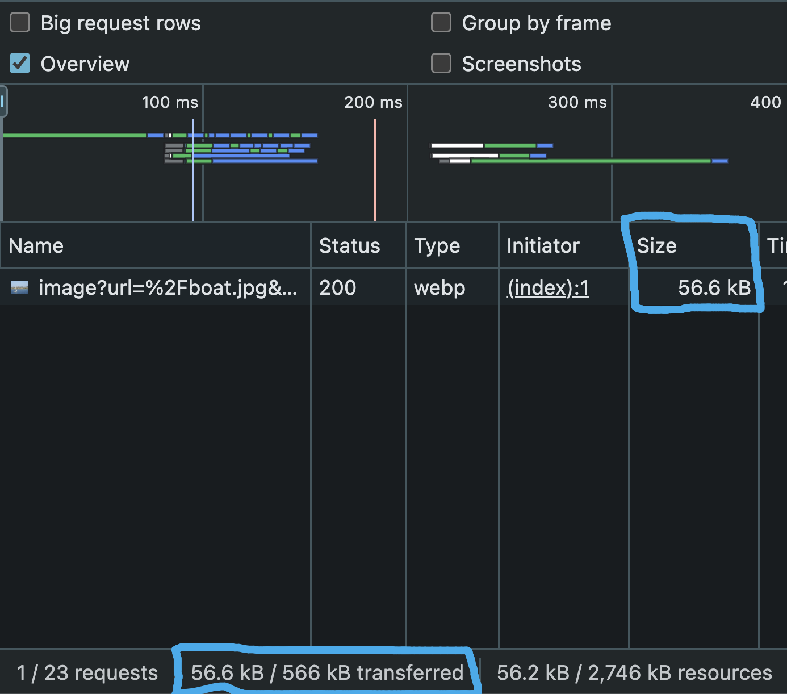
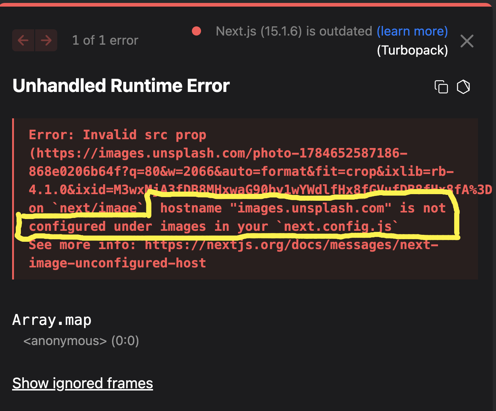

# Image Optimization in Next.js

Images are often one of the largest resources downloaded by a web page. Large, unoptimized images increase page load time, consume more bandwidth, and negatively affect Core Web Vitals.

Next.js provides the built-in **`next/image`** component, which automatically optimizes images to improve performance.

---

# Why Image Optimization Matters

Large images can cause:

- Slow page loading
- Higher bandwidth usage
- Poor Lighthouse scores
- Poor Core Web Vitals
- Bad user experience, especially on slower networks

Instead of serving the original image, Next.js automatically:

- Compresses images
- Converts images to modern formats like **WebP** (when supported)
- Serves properly sized images
- Lazy loads images outside the viewport
- Prevents layout shift

---

# Using the Normal `` Tag

```jsx
const Home = () => {
  return (
    <>
      <div>
        
      </div>
    </>
  );
};

export default Home;
```

Here the browser downloads the **original image** exactly as it exists inside the `public` folder.

---

## Network Request



> Replace the image above with:

```text
images/normal-img-network.png
```

As you can see:

- Original JPEG image is downloaded.
- Size is approximately **2.8 MB**.
- More bandwidth is consumed.
- Page takes longer to load.

---

# Using Next.js Image Component

Import the Image component.

```jsx
import Image from "next/image";
```

Use it like this:

```jsx
import Image from "next/image";

const Home = () => {
  return (
    <>
      <div>
        <Image src="/boat.jpg" width={400} height={300} alt="Boat" />
      </div>
    </>
  );
};

export default Home;
```

---

## Network Request



> Replace the image above with:

```text
images/next-image-network.png
```

Notice the difference.

Instead of downloading

```
boat.jpg
```

Next.js serves

```
/_next/image?...webp
```

The browser now downloads:

- Optimized image
- Compressed image
- WebP format (if supported)

The size becomes approximately

```
56 KB
```

instead of

```
2.8 MB
```

which is a massive performance improvement.

---

# What Next.js Does Automatically

When using

```jsx
<Image />
```

Next.js automatically:

- Optimizes images
- Compresses images
- Converts JPEG/PNG into WebP (or AVIF when possible)
- Resizes images based on device size
- Lazy loads images
- Prevents layout shift
- Caches optimized images

You don't have to perform these optimizations manually.

---

# Width and Height

Unlike the normal `` tag, the Next.js Image component requires dimensions.

```jsx
<Image src="/boat.jpg" width={400} height={300} alt="Boat" />
```

This helps Next.js:

- Calculate aspect ratio
- Prevent layout shifts
- Improve CLS (Cumulative Layout Shift)

---

# Image Quality

Next.js compresses images using a quality value.

By default:

```
quality = 75
```

You can customize it.

```jsx
<Image src="/boat.jpg" width={400} height={300} quality={100} alt="Boat" />
```

Quality range:

```
1 → Lowest quality (smallest size)

100 → Highest quality (largest size)
```

Example:

```jsx
<Image src="/boat.jpg" width={400} height={300} quality={50} alt="Boat" />
```

Lower quality reduces file size but may slightly reduce image clarity.

---

# Lazy Loading

Images loaded with

```jsx
<Image />
```

are lazy loaded by default.

That means:

```
Page Opens

↓

Only visible images download

↓

Images below the viewport wait

↓

Downloaded only when needed
```

This significantly improves the initial page load.

---

# Using Remote Images

Suppose we try to load an image from Unsplash.

```jsx
<Image
  src="https://images.unsplash.com/photo-1784652587186-868e0206b64f?q=80&w=2066"
  width={400}
  height={300}
  alt="Boat"
/>
```

Next.js throws an error.

---

## Runtime Error



> Replace the image above with:

```text
images/remote-image-error.png
```

Error:

```
hostname "images.unsplash.com"
is not configured
under images
in your next.config.mjs
```

This happens because Next.js **does not allow arbitrary external image domains** by default for security and optimization reasons.

---

# Allow External Images

Open

```text
next.config.mjs
```

Configure the hostname.

```js
/** @type {import('next').NextConfig} */

const nextConfig = {
  images: {
    remotePatterns: [
      {
        hostname: "images.unsplash.com",
      },
    ],
  },
};

export default nextConfig;
```

Now images from

```
images.unsplash.com
```

can be optimized.

---

# Allow Multiple Subdomains

Instead of allowing only one hostname, you can allow multiple subdomains.

```js
/** @type {import('next').NextConfig} */

const nextConfig = {
  images: {
    remotePatterns: [
      {
        protocol: "https",
        hostname: "*.unsplash.com",
      },
    ],
  },
};

export default nextConfig;
```

This allows secure HTTPS images from matching Unsplash hosts.

---

# How Next.js Optimizes Images

```
Original Image

        │

        ▼

<Image />

        │

        ▼

Next.js Image Optimizer

        │

        ▼

Compression

        │

        ▼

Resize

        │

        ▼

Convert to WebP

        │

        ▼

Browser Downloads Optimized Image
```

---

# `` vs `<Image>`

| HTML ``               | Next.js `<Image>`                   |
| -------------------------- | ----------------------------------- |
| Downloads original image   | Optimizes automatically             |
| No compression             | Compression built in                |
| No lazy loading            | Lazy loading enabled                |
| No resizing                | Responsive resizing                 |
| No layout shift prevention | Prevents layout shift               |
| Works with any URL         | External domains must be configured |
| Poorer performance         | Better performance                  |

---

# Best Practices

- Always prefer **`next/image`** over the HTML `` tag in Next.js applications.
- Always provide meaningful **`alt`** text for accessibility.
- Specify `width` and `height` (or use the `fill` prop when appropriate).
- Keep the default quality (`75`) unless you have a specific need to change it.
- Store local images in the `public/` folder.
- Configure external image domains in `next.config.mjs` before using remote images.
- Use appropriately sized source images; optimization helps, but extremely large originals still consume processing time.

---

# Key Takeaways

- `next/image` automatically optimizes images for better performance.
- Optimized images are often converted to **WebP**, reducing file size significantly.
- Images are **lazy loaded** by default.
- Width and height help prevent layout shifts.
- The default image quality is **75**, and it can be adjusted between **1–100**.
- Remote image domains must be explicitly allowed in `next.config.mjs`.
- Using `next/image` improves loading speed, bandwidth usage, and Core Web Vitals compared to the standard HTML `` tag.

---

> Here `Frontend` part of **NEXT.js** ends...