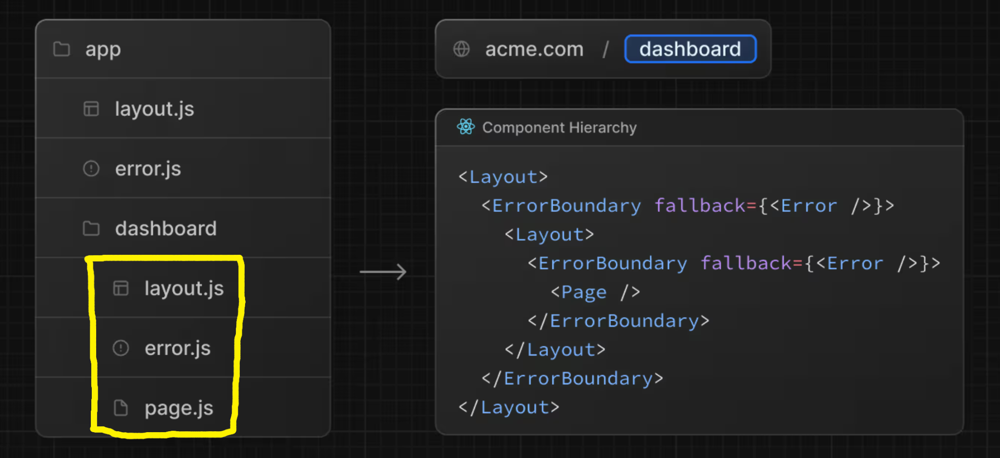

# Error Handling in Nested Routes

## Why Do We Need Nested Error Handling?

Suppose we have the following route structure:

```
app
└── blogs
    ├── page.js
    ├── error.js
    └── [blogID]
        ├── page.js
        ├── layout.js
        └── error.js
```

Each `error.js` acts as an **Error Boundary** for its own route segment.

---

# Example

Initially, we were throwing an error inside

```
app/blogs/[blogID]/page.js
```

```jsx
const randomNumber = Math.random();

if (randomNumber > 0.5) {
  throw new Error("Error occurred");
}
```

Now we move the same code into

```
app/blogs/page.js
```

```jsx
const randomNumber = Math.random();

if (randomNumber > 0.5) {
  throw new Error("Error occurred");
}
```

This allows us to understand how different `error.js` files handle errors.

---

# Moving error.js

Initially

```
app
└── blogs
    └── [blogID]
        └── error.js
```

Later we move it to

```
app
└── blogs
    └── error.js
```

Now this single Error Boundary handles errors from

- `blogs/page.js`
- `blogs/[blogID]/page.js`

because `[blogID]` is a child route of `blogs`.

---

# Nested Layout

Suppose we have

```jsx
export default function BlogLayout({ children }) {
  return (
    <div>
      <p>This is a Blog ID page.</p>
      {children}
    </div>
  );
}
```

Folder structure

```
blogs
└── [blogID]
    ├── layout.js
    ├── error.js
    └── page.js
```

---

# Case 1 - Error in page.js

If

```
page.js
```

throws an error,

```
Layout

↓

Error Boundary

↓

Page
```

Only the **Page** is replaced.

The Layout is still rendered.

Result

```
Layout

+

Error UI
```

So users still see the layout while only the page content changes.

---

### Component Hierarchy



---

# Case 2 - Move error.js to Parent

Now move

```
error.js
```

from

```
blogs/[blogID]
```

to

```
blogs
```

Now the hierarchy becomes

```
Error Boundary

↓

Layout

↓

Page
```

If

```
page.js
```

throws an error,

the Error Boundary replaces **both**

- Layout
- Page

because they are inside the same Error Boundary.

Result

```
Error UI
```

The layout disappears.

---

# Case 3 - Error Inside layout.js

Suppose

```jsx
export default function BlogLayout() {
  throw new Error("Error occurred");

  return <>...</>;
}
```

Can

```
[blogID]/error.js
```

catch this error?

**No.**

Why?

Because both

```
layout.js

and

error.js
```

are at the same route level.

The Layout renders **before** its own Error Boundary can protect the page.

So if the Layout crashes,

its sibling `error.js` never gets a chance to render.

---

# Correct Solution

Move

```
error.js
```

one level above.

```
app
└── blogs
    ├── error.js
    └── [blogID]
        ├── layout.js
        └── page.js
```

Now

```
blogs/error.js
```

wraps the entire

```
[blogID]
```

segment.

So if either

- `layout.js`
- `page.js`

throws an error,

the parent Error Boundary catches it.

---

# How Next.js Thinks

Whenever Next.js finds an

```
error.js
```

it automatically creates an Error Boundary.

Conceptually,

```
<ErrorBoundary>

    <Layout>

        <Page />

    </Layout>

</ErrorBoundary>
```

Only components **inside** an Error Boundary are protected by it.

An Error Boundary **cannot catch errors thrown by itself or by components above it**.

---

# Rule to Remember

Think of an Error Boundary as an umbrella.

```
Error Boundary

↓

Everything Below
```

It protects only the components **under** it.

It cannot protect

- itself
- its parent
- its sibling that renders before it

---

# Summary

### error.js inside `[blogID]`

```
Layout

↓

Error Boundary

↓

Page
```

- Handles `page.js`
- Cannot handle `layout.js`

---

### error.js inside `blogs`

```
Error Boundary

↓

Layout

↓

Page
```

- Handles `layout.js`
- Handles `page.js`

---

# Best Practices

- Place `error.js` as close as possible to the components you want to protect.
- If a `layout.js` can throw an error, place `error.js` one level above that layout.
- Use nested Error Boundaries to isolate failures to specific sections of your application.
- Don't create an `error.js` for every route unless you need different error UIs.

---

# Key Takeaways

- Every `error.js` becomes an Error Boundary automatically.
- An Error Boundary only catches errors from components **below** it.
- A route-level `error.js` can handle errors from its child routes.
- If `layout.js` throws an error, a sibling `error.js` cannot catch it.
- To handle layout errors, move `error.js` to the parent route.
- Proper placement of `error.js` determines which parts of the application are replaced when an error occurs.
